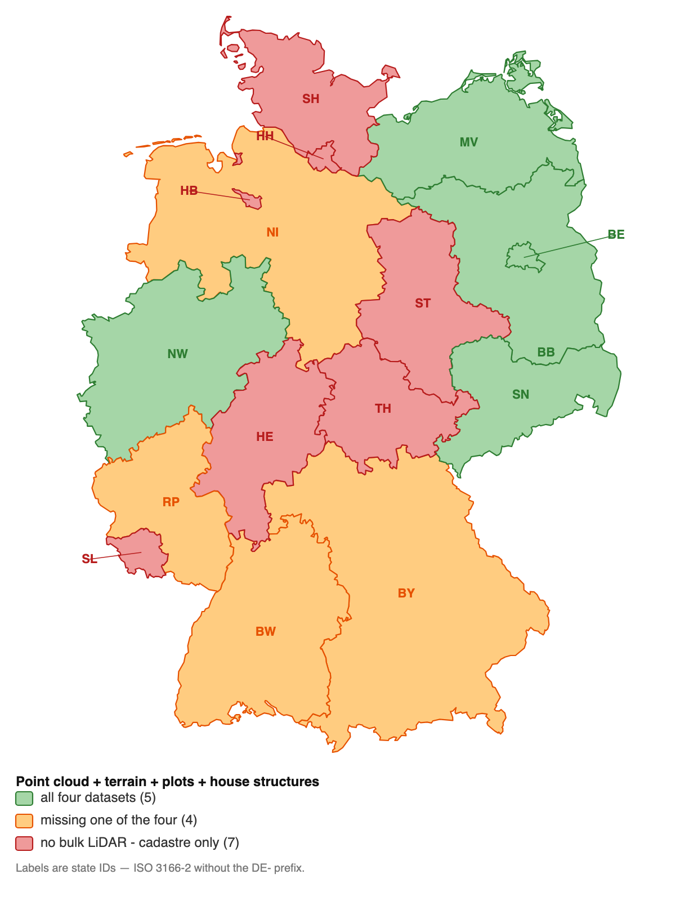

# German state geodata bulk download

Scripts to bulk-download the open geodata of German states and convert it to
cloud-optimized formats.

| Data | Downloader | Coverage |
|------|------------|----------|
| **LiDAR / terrain** | `download_<state>_lidar.sh` (`las`, `dgm1`) | 9 of 16 states — see below |
| **ALKIS (cadastre)** | `download_alkis.sh <state>` | 15 of 16 states |
| **Hauskoordinaten / Hausumringe** | *(source inventory only, no script yet)* | [`hauskoordinaten-hausumringe.md`](hauskoordinaten-hausumringe.md) |

All LiDAR downloaders feed the same converter (`convert_to_cloud_optimized.sh`) and the
same output tree.

**Want all four datasets — point cloud, terrain, parcels, building footprints — for the same
state?** Five states can deliver the whole set: **BB, BE, MV, NW, SN**.



The crossing table, the near-misses (RP and BY have no vector parcels; BW and NI no point
cloud) and the two commands it takes are in
[`bundeslaender.md`](bundeslaender.md#complete-coverage--the-states-where-all-four-datasets-are-fetchable).
The map is generated by [`coverage_map.py`](coverage_map.py) from `bundeslaender.geojson`.

# LiDAR / terrain

## Coverage: all 16 Bundesländer

Every downloader below works **anonymously — no account, no API key, no login.** Counts and
volumes are what the sources reported on 2026-07-28; the scripts recompute them at runtime.

| State | Downloader | `las` (point cloud) | `dgm1` (terrain) | CRS |
|-------|-----------|---------------------|------------------|-----|
| **Bayern** (BY) | `download_by_lidar.sh` | ✅ ~1 km tiles, multi-TB | ✅ 71,979 tiles, 217 GB | 25832 |
| **Berlin** (BE) | `download_be_lidar.sh` | ✅ 9 region packages | ✅ 297 tiles, ~0.2 GB | 25833 |
| **Brandenburg** (BB) | `download_bb_lidar.sh` | ✅ 13,086 tiles, ~1.35 TB | ✅ 31,291 tiles, ~36 GB | 25833 |
| **Mecklenburg-Vorp.** (MV) | `download_mv_lidar.sh` | ✅ 25,466 tiles | ✅ 6,407 tiles | 25833 |
| **Niedersachsen** (NI) | `download_ni_lidar.sh` | ❌ none published | ✅ 49,708 tiles, **already COG** | 25832 |
| **Nordrhein-Westf.** (NW) | `download_nrw_lidar.sh` | ✅ 35,860 tiles, 3.49 TB | ✅ 35,860 tiles, 78.8 GB | 25832 |
| **Rheinland-Pfalz** (RP) | `download_rlp_lidar.sh` | ✅ ~21,207 tiles, 5.18 TB | ✅ ~21,082 tiles, 32.8 GB | 25832 |
| **Sachsen** (SN) | `download_sn_lidar.sh` | ✅ 4,981 tiles (2 km) | ✅ 4,981 tiles (2 km) | 25833 |
| **Baden-Württemberg** (BW) | `download_bw_lidar.sh` | ❌ none published | ✅ 9,370 zips, ~125 GB | 25832 |

### The other seven states

These are **also open data** — none of them puts the LiDAR behind a login — but no anonymous
*bulk* endpoint was verified, so there is no script. The blocker is delivery mechanics, not
access rights.

| State | Status | What blocks a script |
|-------|--------|----------------------|
| **Thüringen** (TH) | Open, DL-DE/BY 2.0. DGM, DOM **and LAZ** offered. | Delivery via the `gaialight` map app. Its `overview.php`/`details.php` need a `type` key that isn't derivable from the client config; the public RSS is a change log, not an inventory. |
| **Schleswig-Holstein** (SH) | Open. DGM1 only — the open-data catalogue lists **no** point cloud. | Same `gaialight` app; `overview.php` returns an empty FeatureCollection without the app's internal filter state. |
| **Sachsen-Anhalt** (ST) | Open since 2023-07-01, DL-DE/BY 2.0, explicitly including classified laser scan results. Atom feeds are advertised. | The advertised Atom endpoint was not locatable under the documented host; the web UI caps manual selection at 5 tiles. |
| **Hessen** (HE) | Open since 2022-02-01, no usage conditions. DGM1 free in the Downloadcenter. | Delivery through an Intershop storefront (`gds.hessen.de`); no static index or feed found. |
| **Hamburg** (HH) | Open via the Transparenzportal. DGM1 published; no point cloud found. | `daten-hamburg.de` returns 403 on directory listings, so tiles can only be reached by exact known URL. |
| **Bremen** (HB) | No open LiDAR bulk product identified. | — |
| **Saarland** (SL) | No open LiDAR bulk product identified. | — |

If you need one of these, the practical route today is the state's interactive portal.

## How the nine downloaders are built

There is no common German standard, so each script reverse-engineers its state's own
publishing mechanism. What they share: **the tile list is never cached** — it is rebuilt from
the authoritative source on every run — and every transfer goes through `aria2c`, so all of
them are parallel and resumable.

| Mechanism | States | Integrity |
|-----------|--------|-----------|
| Metalink-4 manifest with per-tile SHA-256 | RP, BY (`dgm1`) | **hash-verified** |
| `index.json` product inventory | NW | size only |
| Apache directory index | BB | size only |
| INSPIRE Atom feed | BE, MV | size only |
| STAC API | NI | size only |
| Nextcloud public WebDAV share + inventory embedded in the portal's JS | SN | size only |
| Mapbox vector-tile download grid | BW | size only |
| Polygon-to-Metalink service, swept in 1600 km² blocks | BY (`las`) | size only |

Only RLP and Bayern's `dgm1` publish checksums. Everywhere else `--continue` resumes and
sizes are checked, but content is not hash-verified.

All nine share the same CLI:

```bash
./download_<state>_lidar.sh [dgm1|las|both] [output_dir]

DRY_RUN=1 ./download_xx_lidar.sh las      # print the tile count + size, download nothing
JOBS=12 CONN=4 ./download_xx_lidar.sh dgm1
BBOX="minE,minN,maxE,maxN" ./…            # UTM km subset (NI takes WGS84 degrees instead)
```

> **Mind the CRS.** BB, BE, MV and SN are UTM **zone 33** (EPSG:25833); the rest are zone 32
> (EPSG:25832). Tiles from the two groups do not share a grid, so a `BBOX` is only meaningful
> within one zone.

> **Mind the disk.** `las` for NRW alone is 3.5 TB and for RLP 5.2 TB. Always `DRY_RUN=1` first.

# Rheinland-Pfalz

Published by the **Landesamt für Vermessung und Geobasisinformation Rheinland-Pfalz (LVermGeo)**.

## Datasets

| Key   | Product                                  | Format   | Tiles   | Statewide size |
|-------|------------------------------------------|----------|---------|----------------|
| `las` | Classified point cloud, surface+terrain (LPO+LPG) | `.laz` | ~21,207 | **~5.18 TB**   |
| `dgm1`| DGM1 — bare-earth terrain model, 1 m grid | GeoTIFF | ~21,082 | **~32.8 GB**   |

- **Tiling:** 1 km × 1 km, SW (lower-left) corner snapped to whole km.
- **CRS:** ETRS89 / UTM Zone 32 — **EPSG:25832** (LAZ vertical may be compound EPSG:5555).
- **Portal:** <https://geoshop.rlp.de> · files served from `https://geobasis-rlp.de`.

## License — attribution required

**Datenlizenz Deutschland – Namensnennung 2.0 (DL-DE/BY 2.0)** — *not* DL-DE/Zero.
Free, no access restrictions, but you **must** credit:

```
©GeoBasis-DE / LVermGeoRP <year>, dl-de/by-2-0, www.lvermgeo.rlp.de
```

## How it works

The state surveying office publishes official **Metalink-4 (`.meta4`)** manifests listing every
tile with its size and **SHA-256** hash. `aria2c` reads these natively, giving parallel,
**resumable**, integrity-checked downloads from a single command.

Statewide manifests (`07` = RLP state prefix):
- LAS:  `https://geobasis-rlp.de/data/las/current/meta4/las_las_07.meta4`
- DGM1: `https://geobasis-rlp.de/data/dgm1/current/meta4/dgm1_tif_07.meta4`

Sub-state manifests exist if you want less than the whole state — append the
district / Verbandsgemeinde / Gemeinde key: `..._07{kreissch|vgnr|gmdesch}.meta4`.

## Usage

```bash
brew install aria2          # or: apt install aria2

./download_rlp_lidar.sh dgm1                 # ~33 GB  -> ./rlp_lidar/dgm1
./download_rlp_lidar.sh las  /mnt/big/rlp    # ~5.2 TB -> mind your disk & bandwidth!
./download_rlp_lidar.sh both

DRY_RUN=1 ./download_rlp_lidar.sh las        # print tile count + size, download nothing
JOBS=12 CONN=4 ./download_rlp_lidar.sh dgm1  # tune parallelism
```

# Baden-Württemberg

Published by the **Landesamt für Geoinformation und Landentwicklung Baden-Württemberg (LGL)**.

## Datasets

| Key    | Product                                   | Format             | Tiles  | Statewide size |
|--------|-------------------------------------------|--------------------|--------|----------------|
| `dgm1` | DGM1 — bare-earth terrain model, 1 m grid | ASCII **XYZ** in `.zip` | 9,370 zips | **~125 GB** |

- **Tiling:** downloads are **2 km × 2 km ZIPs**, each holding four 1 km × 1 km tiles
  (`*.xyz` + a `*.csv` with acquisition date, accuracy and CRS) — so ~37,480 one-km tiles.
- **CRS:** ETRS89 / UTM Zone 32 — **EPSG:25832**; heights DHHN2016 (compound EPSG:7837).
  The XYZ files themselves carry no CRS; the converter stamps EPSG:25832 on.
- **No point cloud:** BW publishes no open LiDAR point cloud. The portal's `3DM` /
  "Laserscandaten 2000–2005" product is flagged inactive and every `3dm_*.zip` URL 404s,
  so there is no BW counterpart to RLP's `las`. `download_bw_lidar.sh las` says so and exits.
- **Portal:** <https://opengeodata.lgl-bw.de>.

Other products sit on the same 2 km grid and the same URL scheme (`dom1`, `ndom1`, `dgm025`,
`dom5`, `dop20`, `lod1`/`lod2`) — downloading one is a single line in `product_type()`, but
the converter only knows the zipped-XYZ layout `dgm1` uses.

## License — attribution required

**Datenlizenz Deutschland – Namensnennung 2.0 (DL-DE/BY 2.0)** — you must credit:

```
Datenquelle: LGL, www.lgl-bw.de  ·  dl-de/by-2-0
```

## How it works

BW publishes **no manifest**. The portal draws its 2 km download grid as **Mapbox vector
tiles**, and each grid cell carries a JSON blob listing that cell's per-product download URL.
The script fetches the four zoom-7 vector tiles that cover the state, decodes them with a
small stdlib-only MVT reader, and writes an `aria2c` input file. The tile list is therefore
always current rather than hard-coded — and `BBOX` can subset it without extra requests.

Unlike RLP's Metalink, **no checksums are published**: downloads are parallel and resumable
(`--continue`), but only size-checked, not hash-verified.

## Usage

```bash
brew install aria2          # or: apt install aria2

./download_bw_lidar.sh dgm1                  # ~125 GB -> ./bw_lidar/dgm1
./download_bw_lidar.sh dgm1 /mnt/big/bw

DRY_RUN=1 ./download_bw_lidar.sh dgm1        # tile count + sampled size estimate, no download
BBOX="500,5400,520,5420" ./download_bw_lidar.sh dgm1   # subset by UTM32 km (minE,minN,maxE,maxN)
JOBS=12 CONN=4 ./download_bw_lidar.sh dgm1   # tune parallelism
```

Grid cells are named `<easting_km>-<northing_km>` of the SW corner, with **odd** eastings and
**even** northings (e.g. `517-5424`) — `BBOX` is inclusive on both ends.

# Bayern

Published by the **Landesamt für Digitalisierung, Breitband und Vermessung (LDBV)**.
License **DL-DE/BY 2.0** — credit `Datenquelle: Bayerische Vermessungsverwaltung –
www.geodaten.bayern.de, dl-de/by-2-0`. EPSG:25832, 1 km tiles.

The two products are published completely differently:

- **`dgm1`** — a statewide Metalink-4 manifest, 71,979 tiles / 217 GB, with **SHA-256 per
  tile and two mirrors** (`download1/2.bayernwolke.de`). Handled exactly like RLP.
- **`las`** — *no* statewide manifest exists. The point cloud is only reachable through the
  **`poly2metalink` polygon service**, hard-capped at **2000 km² per request**. The script
  sweeps Bavaria in 40×40 km (1600 km²) EWKT polygons, POSTs each, and merges the returned
  metalinks. Those carry URLs only — no sizes, no hashes.

```bash
./download_by_lidar.sh dgm1                            # 217 GB -> ./by_lidar/dgm1
DRY_RUN=1 BBOX="680,5320,760,5400" ./download_by_lidar.sh las    # 6,400 tiles in that box
```

Tiles are addressable directly too: `https://geodaten.bayern.de/odd_data/laser/690_5331.laz`.

# Nordrhein-Westfalen

Published by **Geobasis NRW**. License **DL-DE/Zero 2.0** — no attribution obligation.
EPSG:25832, 1 km tiles, 35,860 tiles per product.

NRW is the cleanest source of the nine: each product directory carries an `index.json`
listing every file with its byte size and timestamp.

- `las` = `3dm_l_las` (3D-Messdaten Laserscanning, `.laz`) — **3.49 TB**
- `dgm1` = `dgm1_tiff` (GeoTIFF) — **78.8 GB**

```bash
./download_nrw_lidar.sh dgm1                 # 79 GB  -> ./nrw_lidar/dgm1
./download_nrw_lidar.sh las /mnt/big/nrw     # 3.5 TB
```

Per-tile direct URL:
`https://www.opengeodata.nrw.de/produkte/geobasis/hm/dgm1_tiff/dgm1_tiff/dgm1_32_280_5652_1_nw_2022.tif`

# Brandenburg

Published by **LGB**. License **DL-DE/BY 2.0** — credit `© GeoBasis-DE/LGB <year>,
dl-de/by-2-0`. **EPSG:25833**, 1 km tiles for both products.

LGB serves both products from a plain indexed directory, so the script just parses the
Apache index (which also carries rounded sizes).

- `las` = `als/laz/` — 13,086 tiles, ~100 MB each, **~1.35 TB**. Coverage is **partial** and
  rolls out campaign by campaign; it is much smaller than the complete `dgm1` grid.
- `dgm1` = `dgm/tif/` — 31,291 tiles, ~1.3 MB each, **~36 GB**. (`dgm/xyz/` holds the same
  grid as ASCII.)

Tile key is `33<E_km>-<N_km>`, e.g. `dgm_33250-5888.zip`.

# Sachsen

Published by **GeoSN**. EPSG:25833, **2 km** tiles, 4,981 tiles per product.

Sachsen publishes neither a manifest nor a directory index. The authoritative inventory is
embedded in the **Batch Download page as JavaScript**: a per-municipality, run-length encoded
list of 1 km grid cells plus a per-product Nextcloud share id. The script decodes that,
aggregates to the 2 km packaging, and subtracts the product's `computed_not_existing` holes
(8 for `dgm1`).

Files come from a **Nextcloud public WebDAV share**. Anonymous `GET` works; `PROPFIND`
(listing) returns 401 — which is exactly why the inventory has to come from the portal page.

```
https://geocloud.landesvermessung.sachsen.de/public.php/dav/files/<share>/dgm1_33334_5652_2_sn_tiff.zip
```

- `las` = `LSC` (Laserscandaten, `.laz` in a zip)
- `dgm1` = `DGM1_TIFF_2km` (GeoTIFF in a zip)

# Niedersachsen

Published by **LGLN**. License **CC BY 4.0** — credit `© LGLN <year>, CC BY 4.0`.
EPSG:25832, 1 km tiles.

Two things make NI unusual:

- Tiles are **already Cloud Optimized GeoTIFFs**, served from IBM Cloud Object Storage.
  `convert_to_cloud_optimized.sh` is *not* needed — the download is the finished product.
- The **STAC catalogue is multi-temporal**: ~70,000 items cover ~48,000 km², because a km²
  that has been reflown appears once per campaign (`…_ni_2016` *and* `…_ni_2025`). The script
  therefore defaults to **`LATEST=1`**, keeping the newest campaign per tile — 49,708 tiles,
  dropping 20,577 older items. Set `LATEST=0` to mirror the whole archive.

`BBOX` here is **WGS84 degrees** (`minLon,minLat,maxLon,maxLat`), because it is passed
straight to the STAC API — unlike every other script, which takes UTM kilometres.

**No point cloud:** the catalogue exposes only `dgm1`. `./download_ni_lidar.sh las` says so
and exits 3.

# Berlin

Published by **GDI Berlin**. License **DL-DE/Zero 2.0** — no attribution obligation.
EPSG:25833. Both products are INSPIRE **Atom** feeds.

- `dgm1` — ATKIS DGM, **2 km** tiles, `DGM1_<E_km>_<N_km>.zip`, 297 tiles, ~0.2 GB total.
- `las` — Airborne Laserscanning, packaged as **9 whole-city-region ZIPs** (`Mitte.zip`,
  `Nord.zip`, `Ost.zip`, …), *not* a tile grid. `BBOX` cannot subset it and is ignored.

Smallest state in the set — the entire DGM1 fits in a couple of hundred megabytes, which
makes Berlin a good smoke test for the toolchain.

# Mecklenburg-Vorpommern

Published by **LAiV M-V**. Attribution **required** — the feed's `<rights>` demands a visible
source note `© GeoBasis-DE/M-V <year>`. EPSG:25833. INSPIRE Atom feeds.

- `las` — ALS point cloud, **1 km** tiles, 25,466 tiles.
- `dgm1` — **2 km** tiles, 6,407 tiles. Note the two products use *different* tile sizes.

**The DGM feed is a trap.** It offers each of the 6,407 tiles in six variants, and only one
is elevation data:

| Suffix | What it actually is |
|--------|---------------------|
| `_gtiff.tif` | **Float32 elevation — the DTM.** What the script takes. |
| `_mix.tif` | 8-bit RGB rendering (a picture of the terrain, not heights) |
| `_zcode.tif` | 8-bit palette height-colour image |
| `_schum_NW.tif` | hillshade |
| `_xyz.zip` | ASCII XYZ of the same grid |
| `_isoli.zip` | derived contour lines |

Taking the feed at face value yields 38,442 "tiles" — six copies of the state, mostly not
elevation. Override with `VARIANT=_xyz.zip` etc. if you want a different one. The dataset
UUID is discovered from the service feed rather than hard-coded.

# ALKIS — the cadastre, all states

`download_alkis.sh` pulls **ALKIS** (*Amtliches Liegenschaftskatasterinformationssystem* —
parcels, building footprints, land use) for any German state that publishes it openly.
Owner names are never open data; every state releases only the *ohne Eigentümer* (oE) variant.

**No state requires a login for what this script downloads.** Per-state status,
licenses and the three content gaps are tabulated in
[`bundeslaender.md`](bundeslaender.md#alkis--cadastral-open-data-per-state).

```bash
brew install aria2          # or: apt install aria2

./download_alkis.sh --list                   # every state key + its datasets
./download_alkis.sh nw                       # NRW, NAS, ~25 GB -> ./alkis/nw
./download_alkis.sh nw gpkg                  # NRW, simplified GeoPackage (much smaller)
./download_alkis.sh bw shape /mnt/big        # -> /mnt/big/bw

DRY_RUN=1 ./download_alkis.sh th             # file count + size estimate, download nothing
JOBS=12 CONN=4 ./download_alkis.sh bb        # tune parallelism
PAGE=50000 ./download_alkis.sh ni            # page size for the WFS/OGC-API states
```

## What each state gives you

| Key | State | Datasets (default first) | Unit | Statewide size |
|-----|-------|--------------------------|------|----------------|
| `bw` | Baden-Württemberg | `nas`, `shape` | Gemarkung (~3,380) | ~23 GB |
| `by` | Bayern | `tn`, `hausumringe`, `verwaltung` | statewide / Bezirk | ~5.4 GB (`tn`) |
| `be` | Berlin | `flurstuecke`, `gebaeude` | WFS pages | ~403k parcels |
| `bb` | Brandenburg | `nas`, `shape` | Landkreis (18) | ~4 GB |
| `hb` | Bremen | `flurstuecke` | one GetFeature | small |
| `hh` | Hamburg | `gml` | statewide, quarterly | ~0.46 GB |
| `he` | Hessen | `flurstuecke`, `zoning` | OGC API pages | ~5.0 M parcels |
| `mv` | Mecklenburg-Vorpommern | `nas` | Gemeinde (~1,450 files) | — |
| `ni` | Niedersachsen | `flurstueck`, `gebaeude` | WFS pages | ~6.3 M parcels |
| `nw` | Nordrhein-Westfalen | `nas`, `gpkg` | Kreis (53) | ~25 GB |
| `rp` | Rheinland-Pfalz | `lika`, `hu` | 1 km tile (20,511) | ~31 GB |
| `sl` | Saarland | `nas`, `shape` | Landkreis (7) | ~2.1 GB |
| `sn` | Sachsen | `nas` | statewide | one ZIP |
| `sh` | Schleswig-Holstein | `geojson` | statewide | ~243 MB |
| `th` | Thüringen | `shape`, `nas` | Flur (~16,500) | ~1.2 GB |
| `st` | Sachsen-Anhalt | — | — | **not published** |

`bw`, `by` and `rp` come with a caveat printed at run time — Bayern publishes no open vector
parcels and RLP only a rasterised cadastral map. `st` exits with an explanation rather than
pretending there is something to fetch.

## How it works

There is no shared national interface, so the script carries one plan per state and four
download engines:

| Engine | States | Mechanism |
|--------|--------|-----------|
| `aria2` | `bw` `by` `bb` `hh` `mv` `nw` `sl` `sn` `sh` `th` | build a file list, hand it to `aria2c` |
| `metalink` | `rp` | official `.meta4` with per-file **SHA-256** → `aria2c --check-integrity` |
| `wfs2` | `be` `ni` | WFS 2.0 paged with `COUNT`/`STARTINDEX` → one GML per page |
| `wfs1` | `hb` | WFS 1.1 has no standard paging; Bremen fits in one request |
| `ogcapi` | `he` | OGC API Features, follow `rel="next"` → one GeoJSON per page |

The file lists are **never hard-coded** — they are rebuilt on every run from whatever each
state publishes as its index:

- **BW** draws its Gemarkung grid as **Mapbox vector tiles** carrying a JSON blob with each
  cell's download URLs — the same trick as its LiDAR 2×2 km grid, so `download_bw_lidar.sh`
  and `download_alkis.sh` share the stdlib-only MVT reader.
- **NRW** serves a machine-readable XML index per product folder.
- **BB** is a plain Apache directory listing.
- **MV** and **TH** publish standards-compliant **INSPIRE ATOM** feeds.
- **HH** is queried through the transparency portal's **CKAN API**, so the newest quarterly
  snapshot is picked automatically rather than pinned.
- **SL** is a password-less public **Nextcloud** share, listed over WebDAV `PROPFIND`.

Only RLP publishes checksums, so only `rp` is hash-verified; everywhere else downloads are
parallel, resumable (`--continue`) and size-checked.

# Convert to cloud-optimized formats

`convert_to_cloud_optimized.sh` turns the downloaded tiles into streamable formats:

| Source                      | Cloud-optimized output            | Tool | Output tree | Notes |
|-----------------------------|-----------------------------------|------|-------------|-------|
| `dgm1` GeoTIFF (RLP)        | **COG** (Cloud Optimized GeoTIFF) | GDAL | `dtm/de/rlp/` | Float32, ZSTD + PREDICTOR=3, AVERAGE overviews, 512px tiles |
| `dgm1` zipped XYZ (BW)      | **COG**, 4 per zip                | GDAL | `dtm/de/bw/`  | same recipe + `-a_srs EPSG:25832 -ot Float32`; 29 MB XYZ → ~1.8 MB COG |
| `las` `.laz` (RLP)          | **COPC** (`.copc.laz`)            | PDAL | `point-cloud/de/rlp/` | octree-indexed, HTTP range-streamable; ~189 MB LAZ → ~144 MB COPC |

Output is organized by product type then ISO-style location (`de` = Germany, then the state),
relative to an optional `output_base` (default `.`):

```
<output_base>/dtm/de/rlp/dgm1_32_400_5580_1_rp_2024.tif
<output_base>/dtm/de/bw/dgm1_32_517_5424_1_bw_2023.tif
<output_base>/point-cloud/de/rlp/LAS_320_5510_las12.copc.laz
```

```bash
brew install gdal pdal

./convert_to_cloud_optimized.sh dgm1                    # ./rlp_lidar/dgm1 -> ./dtm/de/rlp
./convert_to_cloud_optimized.sh las                     # ./rlp_lidar/las  -> ./point-cloud/de/rlp
./convert_to_cloud_optimized.sh both ./rlp_lidar /data  # -> /data/{dtm,point-cloud}/de/rlp

./convert_to_cloud_optimized.sh bw dgm1                 # ./bw_lidar/dgm1  -> ./dtm/de/bw
./convert_to_cloud_optimized.sh bw dgm1 ./bw_lidar /data

DRY_RUN=1 ./convert_to_cloud_optimized.sh las           # list, convert nothing
JOBS=8 ./convert_to_cloud_optimized.sh dgm1             # cap parallelism (default = CPU count)
KEEP=0 ./convert_to_cloud_optimized.sh dgm1             # delete each source after a verified convert
```

The leading state token (`rlp` | `bw`) is optional and defaults to `rlp`, so the original
invocations are unchanged. BW zips are unpacked to a temp dir per zip, converted, then the
temp dir is removed; a zip whose four COGs already exist and are newer is skipped without
unpacking (`KEEP=0` deletes the zip after all four convert cleanly).

> **The converter still only knows `rlp` and `bw`.** The seven new downloaders are not wired
> into it. Their layouts differ — NRW and BY ship bare `.tif`/`.laz` (closest to RLP), BB/SN/BE
> ship one-file-per-zip (closest to BW), MV ships bare `.tif`, and NI needs no conversion at
> all because its tiles are already COGs. Adding them is a per-state entry in the converter's
> layout table, not new logic.

- Re-running **skips** already-converted, up-to-date outputs (safe to resume).
- COG compression is overridable via `COG_COMPRESS` / `COG_PRED` / `COG_LEVEL` — if your GDAL
  build has the **LERC** codec, `COG_COMPRESS=LERC_ZSTD` is ideal for elevation (this brew build lacks it).
- COPC is **CPU-heavy** (~20–30 s/tile); the full ~21k-tile point cloud is a long run — size accordingly.

# Notes

**All states**

- **Never cache a tile list** — coverage is regenerated as campaigns land, so every downloader
  rebuilds its own on each run (RLP/BY re-fetch the manifest, NRW the `index.json`, BB the
  directory index, BE/MV the Atom feed, NI the STAC pages, SN the portal's embedded inventory,
  BW the vector-tile grid).
- **Resume** is automatic (`--continue`) everywhere. Integrity: only RLP and BY `dgm1` publish
  SHA-256; everywhere else only size is checked.
- **Two UTM zones.** RP, BW, BY, NW, NI are EPSG:**25832**; BB, BE, MV, SN are EPSG:**25833**.
  Within a zone all states share the same grid origin (SW corner snapped to whole km), so their
  tiles line up across state borders. Across zones they do not — reproject before mosaicking.
- **Tile sizes differ**: 1 km for RP/BY/NW/NI/BB/MV-`las`, 2 km for SN/BE/MV-`dgm1`/BW.
- Nothing here needs credentials. Where a state is missing, it is because no anonymous *bulk*
  endpoint was found — not because the data is gated.

**RLP**

- **bDOM** (image-based DSM) is open data on the same portal but no bulk `.meta4` was verified.
- Per-tile direct URL (alternative to the manifest), e.g. tile SW-corner 320 km E / 5510 km N:
  `https://geobasis-rlp.de/data/las/current/las/lpolpg_32_320_5510_1_rp.laz`

**BW**

- Per-tile direct URL, e.g. the 2 km cell at 517 km E / 5424 km N:
  `https://opengeodata.lgl-bw.de/data/dgm/dgm1_32_517_5424_2_bw.zip`
- Each 1 km XYZ is 29 MB of text (1,000,000 lines) — expect the unzip+convert step to be
  I/O-bound, ~2 s/tile; statewide that is ~37k tiles.
- The `.csv` beside each XYZ carries acquisition date, update date, accuracy (0.15 m) and the
  height reference — worth keeping if provenance matters; the converter ignores it.

# Sources

**RLP**

- Product/license: <https://lvermgeo.rlp.de/geodaten-geoshop/open-data>
- Machine config (URL schemes): <https://geoshop.rlp.de/files/anpassungen/hvd/products/las.json>
- Metadata: <https://gdk.gdi-de.org/geonetwork/srv/api/records/3d339d76-6160-49d2-bf47-a93e05f76ab2>

**BW**

- Portal: <https://opengeodata.lgl-bw.de> · product/license overview:
  <https://www.lgl-bw.de/Produkte/Open-Data/index.html>
- Product catalogue (JSON the portal itself reads): <https://opengeodata.lgl-bw.de/assets/config/local/odp-products.json>
- Download grid (vector tiles + bounds): `https://opengeodata.lgl-bw.de/tiles/vts/2x2Gitter/{z}/{x}/{y}.pbf`,
  <https://opengeodata.lgl-bw.de/tiles/vts/2x2Gitter/metadata.json>
- DGM1 metadata record: <https://metadaten.geoportal-bw.de/geonetwork/srv/api/records/8ca22d63-e92d-4ca1-879e-68f62978b21a>

**BY**

- Portal: <https://geodaten.bayern.de/opengeodata/>
- Product catalogue the portal reads: <https://geodaten.bayern.de/opengeodata/json/opengeodata_datensaetze.json>
- DGM1 manifest: `https://geodaten.bayern.de/odd/a/dgm/dgm1/meta/metalink/09.meta4`
- Polygon service (limits + metalink): `https://geoservices.bayern.de/services/poly2metalink/datasets/laser`,
  `POST https://geoservices.bayern.de/services/poly2metalink/metalink/laser` (body = EWKT)
- Metalink usage notes: <https://www.geodaten.bayern.de/odd/m/3/pdf/informationen_metalink.pdf>

**NW**

- Portal: <https://www.opengeodata.nrw.de>
- Product tree: `https://www.opengeodata.nrw.de/produkte/geobasis/hm/` (each folder has an `index.json`)

**BB**

- Portal: <https://data.geobasis-bb.de/geobasis/daten/>
- Product pages: <https://geobasis-bb.de/lgb/de/geodaten/3d-produkte/laserscandaten/>,
  <https://geobasis-bb.de/lgb/de/geodaten/3d-produkte/gelaendemodell/>
- Coverage/currency PDFs: `https://data.geobasis-bb.de/geobasis/information/aktualitaeten/`

**SN**

- Portal: <https://www.geodaten.sachsen.de> · height products:
  <https://www.geodaten.sachsen.de/downloadbereich-digitale-hoehenmodelle-4851.html>
- Batch page carrying the inventory JS: <https://www.geodaten.sachsen.de/batch-download-4719.html>
- 2 km grid shapefile: <https://www.geodaten.sachsen.de/download/Shape_km2_33_UTM.zip>

**NI**

- Portal: <https://opengeodata.lgln.niedersachsen.de>
- STAC API: <https://dgm.stac.lgln.niedersachsen.de/collections/dgm1>

**BE**

- DGM1 Atom: <https://gdi.berlin.de/data/dgm1/atom/> · ALS Atom: <https://gdi.berlin.de/data/a_als/atom/>
- Catalogue: <https://daten.berlin.de>

**MV**

- DGM Atom: <https://www.geodaten-mv.de/dienste/dgm_atom> · ALS Atom: <https://www.geodaten-mv.de/dienste/als_atom>
- Open-data overview: <https://www.laiv-mv.de/Geoinformation/Open_Data_Angebot/>

**States without a script** (starting points if you want to add one)

- TH: <https://geoportal.geoportal-th.de/gaialight-th/_apps/dladownload/dl-dhm.html>
- SH: <https://geodaten.schleswig-holstein.de/gaialight-sh/_apps/dladownload/dl-dgm1.html>
- ST: <https://www.lvermgeo.sachsen-anhalt.de/de/gdp-open-data.html>
- HE: <https://hvbg.hessen.de/geoinformation/open-data>
- HH: <https://suche.transparenz.hamburg.de/> (CKAN API at `/api/3/action/package_search`)

**ALKIS** (one per state, all verified live July 2026)

- BW: <https://opengeodata.lgl-bw.de> · grid `tiles/vts/Gemarkungen/{z}/{x}/{y}.pbf`, files `/data/alkis/`
- BY: product catalogue <https://geodaten.bayern.de/opengeodata/json/opengeodata_produkte.json>
- BE: <https://gdi.berlin.de/services/wfs/alkis_flurstuecke> · <https://daten.berlin.de>
- BB: <https://data.geobasis-bb.de/geobasis/daten/alkis/Vektordaten/>
- HB: <https://geodienste.bremen.de/wfs_hduk2958loah3976niun> · <https://www.geo.bremen.de/produkte/open-data-produktuebersicht-15654>
- HH: <https://suche.transparenz.hamburg.de/api/3/action/package_search?q=title:ALKIS%20Liegenschaftskarte>
- HE: <https://www.geoportal.hessen.de/spatial-objects/710> · portal <https://hvbg.hessen.de/geoinformation/open-data>
- MV: <https://www.geodaten-mv.de/dienste/alkis_nas_atom>
- NI: <https://opendata.lgln.niedersachsen.de/doorman/noauth/alkis_wfs_nas>
- NW: <https://www.opengeodata.nrw.de/produkte/geobasis/lk/akt/>
- RP: <https://geobasis-rlp.de/data/lika/current/meta4/> · product config <https://geoshop.rlp.de/files/anpassungen/hvd/products/lika.json>
- SL: <https://www.shop.lvgl.saarland.de/cloud/freiegeobasisdaten>
- SN: <https://www.geodaten.sachsen.de/downloadbereich-alkis-4176.html>
- ST: <https://www.lvermgeo.sachsen-anhalt.de/de/gdp-open-data.html> (ALKIS **not** included)
- SH: <https://geodaten.schleswig-holstein.de/gaialight-sh/_apps/dladownload/dl-alkis.html>
- TH: <https://geoportal.geoportal-th.de/dienste/atom_th_alkis>
