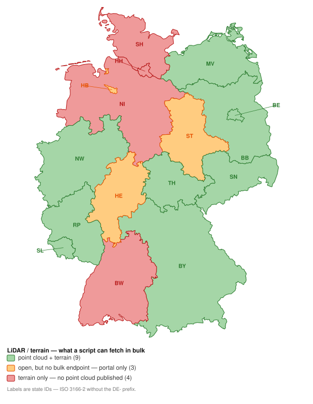
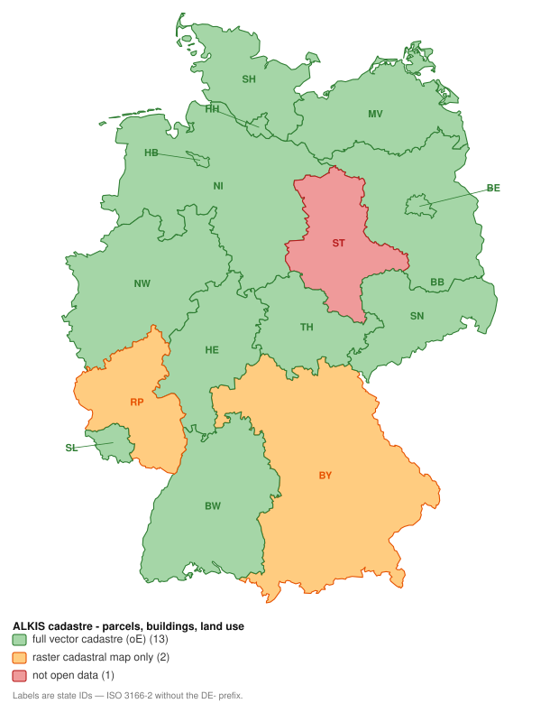
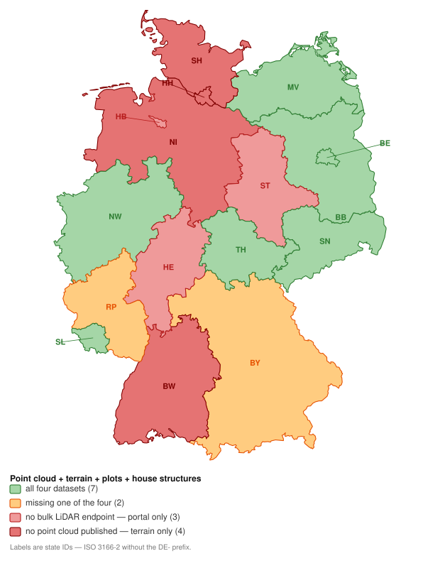

# German geodata coverage by Bundesland

Per-state availability, as maps and tables. Everything else — how the downloaders work, the
per-state notes, the DuckDB loading — is in [`README_download.md`](README_download.md).

Symbols in the availability columns of §1 and §3: ✅ open, and a script here fetches it in
bulk · ◐ partly — only part of the state, or open but not yet wired in · ⚠️ open, but no bulk
endpoint found (portal, login or CAPTCHA only) · ❌ not published as open data. In §2's
*ALKIS as open data* column, ⚠️ instead means the cadastre itself is partial — a raster
cadastral map, with no vector parcels in it.

# 1. LiDAR / terrain availability

| ID | State | Point cloud | DTM (DGM1) | Bulk downloader | CRS | Licence |
|----|-------|:-----------:|:----------:|-----------------|-----|---------|
| **BW** | Baden-Württemberg | ❌ | ✅ | `download_bw_lidar.sh` | 25832 | DL-DE/BY 2.0 |
| **BY** | Bayern | ✅ | ✅ | `download_by_lidar.sh` | 25832 | DL-DE/BY 2.0 |
| **BE** | Berlin | ✅ | ✅ | `download_be_lidar.sh` | 25833 | DL-DE/Zero 2.0 |
| **BB** | Brandenburg | ✅ | ✅ | `download_bb_lidar.sh` | 25833 | DL-DE/BY 2.0 |
| **HB** | Bremen | ⚠️ | ⚠️ | — | — | — |
| **HH** | Hamburg | ❌ | ⚠️ | — | 25832 | open (Transparenzportal) |
| **HE** | Hessen | ⚠️ | ⚠️ | — | 25832 | open, no conditions (since 2022) |
| **MV** | Mecklenburg-Vorpommern | ✅ | ✅ | `download_mv_lidar.sh` | 25833 | open, attribution required |
| **NI** | Niedersachsen | ❌ | ✅ | `download_ni_lidar.sh` | 25832 | CC BY 4.0 |
| **NW** | Nordrhein-Westfalen | ✅ | ✅ | `download_nrw_lidar.sh` † | 25832 | DL-DE/Zero 2.0 |
| **RP** | Rheinland-Pfalz | ✅ | ✅ | `download_rlp_lidar.sh` † | 25832 | DL-DE/BY 2.0 |
| **SL** | Saarland | ✅ | ◐ | `download_sl_lidar.sh` (`las`) | 25832 | DL-DE/BY 2.0 |
| **SN** | Sachsen | ✅ | ✅ | `download_sn_lidar.sh` | 25833 | DL-DE/Zero 2.0 |
| **ST** | Sachsen-Anhalt | ◐ | ⚠️ | `download_st_lidar.sh` (`las`, samples only) | 25832 | DL-DE/BY 2.0 (since 2023) |
| **SH** | Schleswig-Holstein | ❌ | ⚠️ | — | 25832 | open |
| **TH** | Thüringen | ✅ | ✅ | `download_th_lidar.sh` (`las`, `dgm1`, `dom1`) | 25832 | DL-DE/BY 2.0 |

† The two script filenames that do not match their ID — see
[The state ID](README_download.md#the-state-id).

**SL and ST are the two rows where the table and the map disagree on purpose.** The map
colours by what a state *publishes*, so SL is green: its DGM1 is open, in the same share the
point cloud comes from — but `download_sl_lidar.sh` fetches the point cloud only, which is
why the DTM column is ◐ until that folder is wired in. ST is the mirror image: it has a
downloader, but the map keeps it in the portal-only tier because what Sachsen-Anhalt gives
away anonymously is two sample areas (62 tiles, ~0.1% of the state) and the statewide point
cloud is still order-and-invoice. Both are spelled out in
[README_download.md](README_download.md#2-lidar--terrain-availability).

# 2. ALKIS / cadastre availability

| ID | State | ALKIS as open data | Download | How | Format · unit | License |
|----|-------|--------------------|----------|-----|---------------|---------|
| **BW** | Baden-Württemberg | ✅ full (oE) | **anonymous** | vector-tile grid → ZIP | NAS, Shape · Gemarkung (~3,380) | DL-DE/BY 2.0 |
| **BY** | Bayern | ⚠️ **partial** | **anonymous** | static ZIP / GPKG | no vector Flurstücke — see below | CC BY 4.0 |
| **BE** | Berlin | ✅ full (oE) | **anonymous** | WFS 2.0 only | GML · statewide (~403k parcels) | DL-DE/Zero 2.0 |
| **BB** | Brandenburg | ✅ full (oE) | **anonymous** | directory listing | NAS, Shape · Landkreis (18) | DL-DE/BY 2.0 |
| **HB** | Bremen | ✅ full (oE) | **anonymous** | WFS 1.1 only | GML · statewide | CC BY 4.0 |
| **HH** | Hamburg | ✅ "ausgewählte Daten" | **anonymous** | CKAN API → ZIP | GML · statewide, quarterly | DL-DE/BY 2.0 |
| **HE** | Hessen | ✅ full (oE) | **anonymous** via API **login** for file packages | OGC API Features / WFS | GeoJSON, GML · statewide (~5.0 M parcels) | DL-DE/Zero 2.0 |
| **MV** | Mecklenburg-Vorpommern | ✅ full (oE) | **anonymous** | INSPIRE ATOM feed | NAS, Shape · Gemeinde (724) | CC BY 4.0 |
| **NI** | Niedersachsen | ✅ full (oE) | **anonymous** | WFS 2.0 (NAS) only | GML · statewide (~6.3 M parcels) | DL-DE/BY 2.0 |
| **NW** | Nordrhein-Westfalen | ✅ full (oE) | **anonymous** | XML index → ZIP | NAS, simplified GPKG · Kreis (53) | DL-DE/Zero 2.0 |
| **RP** | Rheinland-Pfalz | ⚠️ **raster only** | **anonymous** | Metalink-4 | GeoTIFF cadastral map · 1 km tile | DL-DE/BY 2.0 |
| **SL** | Saarland | ✅ full (oE) | **anonymous** | public WebDAV share | NAS, Shape · Landkreis (7) | DL-DE/BY 2.0 |
| **SN** | Sachsen | ✅ full (oE) | **anonymous** | single ZIP | NAS · statewide | DL-DE/BY 2.0 |
| **ST** | Sachsen-Anhalt | ✅ vereinfacht (oE) | **anonymous** | WFS 2.0 only | GML · statewide (~2.7 M parcels) | DL-DE/BY 2.0 |
| **SH** | Schleswig-Holstein | ✅ full (oE), but two-step | **anonymous** | index file → per-Flur NAS | GeoJSON index (~243 MB) → `.xml.gz` per Flur | CC BY 4.0 |
| **TH** | Thüringen | ✅ full (oE) | **anonymous** | INSPIRE ATOM feed | Shape, NAS · Flur (~16,500) | DL-DE/BY 2.0 |

# 3. Complete coverage — all four datasets

| ID | State | Point cloud | DTM (DGM1) | Plots (Flurstücke) | House structures |
|----|-------|-------------|------------|--------------------|------------------|
| **BW** | Baden-Württemberg | ❌ `3DM` flagged inactive, every URL 404s | ✅ `download_bw_lidar.sh` — ~125 GB | ✅ `download_alkis.sh bw` — NAS/Shape, ~3,380 Gemarkungen | ✅ inside that package; also standalone HU + HK ZIPs |
| **BY** | Bayern | ✅ `download_by_lidar.sh` | ✅ same | ❌ **raster only** — ALKIS-Parzellarkarte; vector parcels sold through GeodatenOnline | ✅ `… by hausumringe` — Shape ×7 Bezirke, CC BY 4.0 (HK priced) |
| **BE** | Berlin | ✅ `download_be_lidar.sh` | ✅ same | ✅ `download_alkis.sh be flurstuecke` — WFS 2.0 | ✅ `… be gebaeude`; also an HK-DE-format ZIP |
| **BB** | Brandenburg | ✅ `download_bb_lidar.sh` | ✅ same | ✅ `download_alkis.sh bb` — NAS/Shape, 18 Landkreise | ✅ inside that same ALKIS package |
| **HB** | Bremen | ⚠️ no open bulk product identified | ⚠️ same | ✅ `download_alkis.sh hb` — WFS 1.1, single GML | ⚠️ INSPIRE WFS only, not wired into the downloader |
| **HH** | Hamburg | ❌ no point cloud found | ⚠️ published, but `daten-hamburg.de` 403s directory listings | ✅ `download_alkis.sh hh` — quarterly "ausgewählte Daten" GML | ⚠️ snapshot-versioned GML/WFS via the Transparenzportal, no stable URL |
| **HE** | Hessen | ⚠️ Intershop storefront, no static index | ⚠️ same | ✅ `download_alkis.sh he` — OGC API Features, ~5.0 M parcels | ⚠️ HU free but needs a `gds.hessen.de` account |
| **MV** | Mecklenburg-Vorpommern | ✅ `download_mv_lidar.sh` | ✅ same | ✅ `download_alkis.sh mv` — NAS + Shape, 724 Gemeinden | ✅ that package, plus a dedicated HU Atom ZIP |
| **NI** | Niedersachsen | ❌ none published — STAC exposes `dgm1` only | ✅ `download_ni_lidar.sh` — already COG | ✅ `download_alkis.sh ni` — WFS 2.0 NAS, ~6.3 M parcels | ✅ `… ni gebaeude` (standalone HK/HU priced) |
| **NW** | Nordrhein-Westfalen | ✅ `download_nrw_lidar.sh` † | ✅ same | ✅ `download_alkis.sh nw` — NAS/GPKG, 53 Kreise | ✅ that package, plus `gru_vereinfacht` + `gebref` |
| **RP** | Rheinland-Pfalz | ✅ `download_rlp_lidar.sh` † | ✅ same | ❌ **raster only** — `lika` GeoTIFF Liegenschaftskarte; vector geometry only per-query via the Flurstückssuche WFS | ✅ `download_alkis.sh rp hu` — ZIP + `.meta4`, HK the same way |
| **SL** | Saarland | ✅ `download_sl_lidar.sh` | ◐ open in the same share, **not yet scripted** | ✅ `download_alkis.sh sl` — NAS/Shape, 7 Landkreise | ✅ inside that package (standalone HU is INSPIRE WFS only) |
| **SN** | Sachsen | ✅ `download_sn_lidar.sh` | ✅ same | ✅ `download_alkis.sh sn` — NAS, one statewide ZIP | ✅ that package, plus standalone HU/HK ZIPs |
| **ST** | Sachsen-Anhalt | ◐ `download_st_lidar.sh` — 2 sample areas (62 tiles); statewide is priced/on request | ⚠️ free, but the UI caps a selection at 5 tiles | ✅ `download_alkis.sh st` — vereinfacht WFS, ~2.7 M parcels | ✅ `… st gebaeude` (~1.7 M); also a direct HU ZIP |
| **SH** | Schleswig-Holstein | ❌ none in the open-data catalogue | ⚠️ `gaialight` app returns an empty FeatureCollection | ⚠️ `download_alkis.sh sh` fetches the **Flur index** (~243 MB); the NAS is behind its `LINK_DATA` links | ⚠️ HU/HK only through the interactive download client |
| **TH** | Thüringen | ✅ `download_th_lidar.sh` | ✅ same | ✅ `download_alkis.sh th` — Shape/NAS per Flur (~16,500) | ✅ inside that package (standalone HU/HK are CAPTCHA-gated) |
