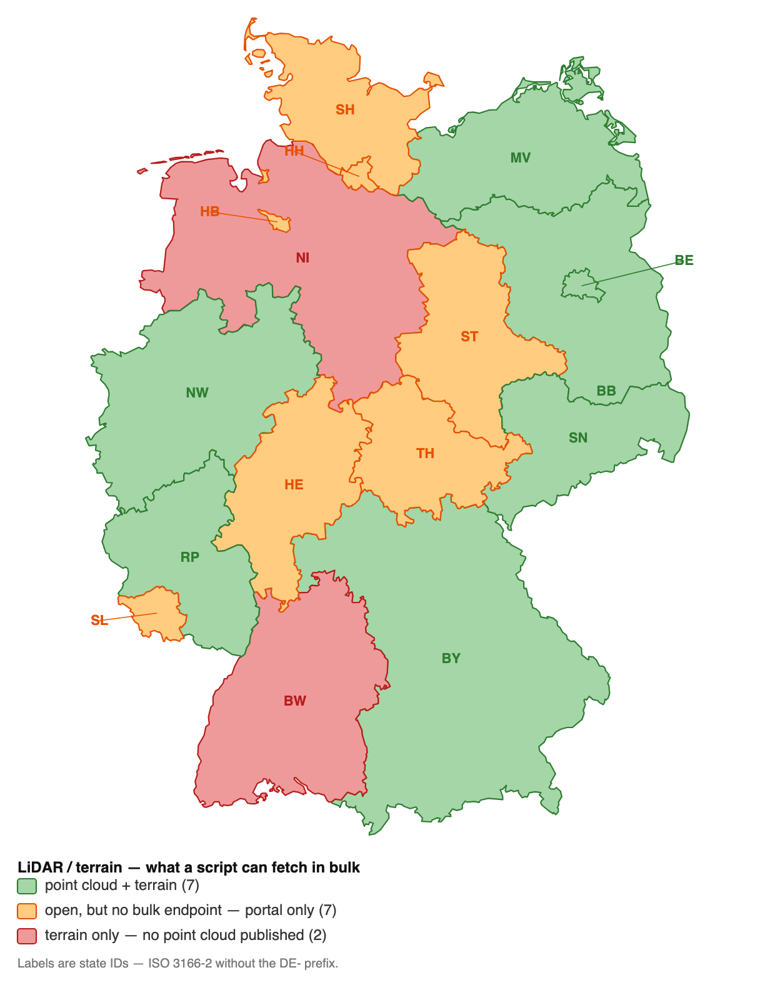
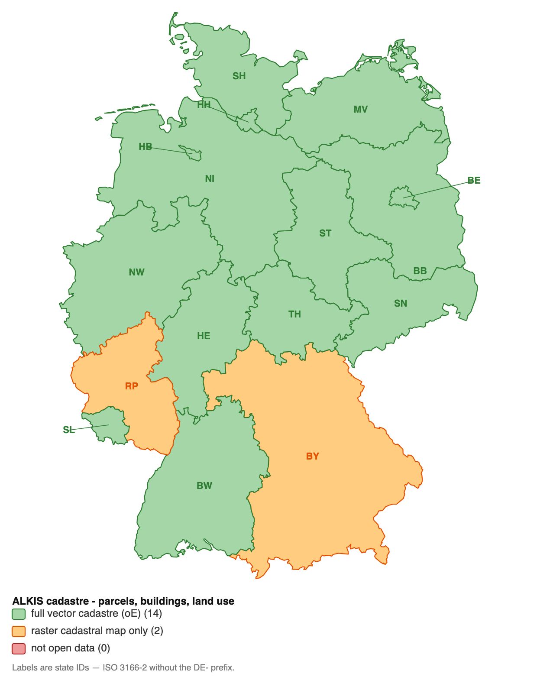

# German state geodata bulk download

Scripts to bulk-download the open geodata of Germany's 16 federal states (*Bundesländer*) and
convert it to cloud-optimized formats. Everything here works **anonymously — no account, no
API key, no login.** Where a state is missing, it is because no anonymous *bulk* endpoint was
found, not because the data is gated.

| Data | Downloader | Coverage |
|------|------------|----------|
| **LiDAR / terrain** | `download_<id>_lidar.sh` (`las`, `dgm1`) | 9 of 16 states |
| **ALKIS (cadastre)** | `download_alkis.sh <id>` | 16 of 16 states |
| **All of the above at once** | `download_all.sh` | [Downloading everything](#downloading-everything) |
| **Hauskoordinaten / Hausumringe** | *(source inventory only, no script yet)* | [`hauskoordinaten-hausumringe.md`](hauskoordinaten-hausumringe.md) |
| **Nationwide parcels, paid** | *(not scriptable — ships on a USB drive)* | [`flurstuecke-commercial.md`](flurstuecke-commercial.md) |

All LiDAR downloaders feed the same converter (`convert_to_cloud_optimized.sh`) and the same
output tree. States are keyed by a two-letter **ID** throughout — see
[The state ID](#the-state-id).
Status was surveyed live on **2026-07-28**; counts and volumes are what the sources reported
then, and every script recomputes them at runtime (`DRY_RUN=1`).

**Contents** — the three availability questions first, then the detail:

1. [Complete coverage — all four datasets](#1-complete-coverage--all-four-datasets)
2. [LiDAR / terrain availability](#2-lidar--terrain-availability)
3. [ALKIS / cadastre availability](#3-alkis--cadastre-availability)

---

# Downloading everything

The per-state scripts each take one state and one dataset. `download_all.sh` walks the whole
matrix — 29 ALKIS combinations across 16 states, 16 LiDAR combinations across 9 — into one
state-major tree:

```
<root>/alkis/<id>-<dataset>/      ./alkis/nw-nas, ./alkis/bw-shape, ./alkis/st-flurstueck
<root>/lidar/<id>-<dataset>/      ./lidar/nw-dgm1, ./lidar/rp-las
```

```bash
./download_all.sh --list                 # the matrix, its sizes, and where each part lands
./download_all.sh alkis                  # 29 combinations, ~132 GB + 23 M streamed features
./download_all.sh dgm1                   # 9 terrain models, ~600 GB
./download_all.sh all /mnt/big           # everything, including 12 TB+ of point cloud

DRY_RUN=1 ./download_all.sh all          # every sub-script prints its plan, downloads nothing
ONLY=nw,bw ./download_all.sh alkis       # two states only
SKIP=by,rp ./download_all.sh alkis       # drop the two states with no vector Flurstücke
```

One flat directory per product is not just tidiness. The four ALKIS states served by a WFS or
OGC API (BE, HE, NI, ST) page their output into `part-00001.gml` whatever dataset was asked
for, so two of their datasets sharing a directory would overwrite each other silently. The
`<id>-<dataset>` leaf makes that impossible.

A failing combination is logged to `<root>/.download_all.failures` and the walk continues;
re-running the same command retries it and resumes everything else. The only change this makes
to the per-state scripts is `OUTDIR=` — set it yourself and any of them writes straight into
the path you give instead of appending its own subdirectory.

---

# 1. Complete coverage — all four datasets

Sections 2 and 3 each answer one dataset at a time. This one answers the crossing question:
**for which states can we fetch point cloud *and* terrain *and* parcels *and* building
footprints?** Footprint sources are detailed in
[`hauskoordinaten-hausumringe.md`](hauskoordinaten-hausumringe.md).

**Five states: BB, BE, MV, NW, SN.**


| ID | State | Point cloud | DTM (DGM1) | Plots (Flurstücke) | House structures |
|----|-------|-------------|------------|--------------------|------------------|
| **BB** | Brandenburg | ✅ `download_bb_lidar.sh` | ✅ same | ✅ `download_alkis.sh bb` — NAS/Shape, 18 Landkreise | ✅ inside that same ALKIS package |
| **BE** | Berlin | ✅ `download_be_lidar.sh` | ✅ same | ✅ `download_alkis.sh be flurstuecke` — WFS 2.0 | ✅ `… be gebaeude`; also an HK-DE-format ZIP |
| **MV** | Mecklenburg-Vorpommern | ✅ `download_mv_lidar.sh` | ✅ same | ✅ `download_alkis.sh mv` — NAS, ~750 Gemeinden | ✅ that package, plus a dedicated HU Atom ZIP |
| **NW** | Nordrhein-Westfalen | ✅ `download_nrw_lidar.sh` † | ✅ same | ✅ `download_alkis.sh nw` — NAS/GPKG, 53 Kreise | ✅ that package, plus `gru_vereinfacht` + `gebref` |
| **SN** | Sachsen | ✅ `download_sn_lidar.sh` | ✅ same | ✅ `download_alkis.sh sn` — NAS, one statewide ZIP | ✅ that package, plus standalone HU/HK ZIPs |

Footprints are never a separate fetch in these five: ALKIS carries `AX_Gebaeude`, so the
parcel download brings them along. The extra products in the last column are convenience —
smaller, simpler files than a full NAS package for anyone who wants only footprints.

Picking between them: **NW** is the strongest — every product carries a machine-readable
index, and DL-DE/Zero 2.0 means no attribution obligation. **BE** is the fastest to fetch
end to end (~0.2 GB of DGM1, 9 point-cloud packages, WFS cadastre) and also DL-DE/Zero, which
makes it the natural smoke test for a full four-dataset pipeline. **BB** carries one caveat:
its point cloud is still **partial** — 13,086 LAZ tiles against a complete 31,291-tile DGM1
grid, released campaign by campaign.

This map and the two below it are drawn by [`coverage_map.py`](coverage_map.py) from
`bundeslaender.geojson`, so they follow the data rather than these tables. Regenerate all
three with `./coverage_map.py all` after any coverage change; each also has an `.svg` beside
its `.png`, same image as vector, with a per-state tooltip the PNG cannot carry.

## Why the other eleven fall short

Same columns as above, so the gaps line up. ✅ available and scripted · ⚠️ open but no bulk
endpoint found · ❌ not published as open data.

| ID | State | Point cloud | DTM (DGM1) | Plots (Flurstücke) | House structures |
|----|-------|-------------|------------|--------------------|------------------|
| **RP** | Rheinland-Pfalz | ✅ `download_rlp_lidar.sh` † | ✅ same | ❌ **raster only** — `lika` GeoTIFF Liegenschaftskarte; vector geometry only per-query via the Flurstückssuche WFS | ✅ `download_alkis.sh rp hu` — ZIP + `.meta4`, HK the same way |
| **BY** | Bayern | ✅ `download_by_lidar.sh` | ✅ same | ❌ **raster only** — ALKIS-Parzellarkarte; vector parcels sold through GeodatenOnline | ✅ `… by hausumringe` — Shape ×7 Bezirke, CC BY 4.0 (HK priced) |
| **BW** | Baden-Württemberg | ❌ `3DM` flagged inactive, every URL 404s | ✅ `download_bw_lidar.sh` — ~125 GB | ✅ `download_alkis.sh bw` — NAS/Shape, ~3,380 Gemarkungen | ✅ inside that package; also standalone HU + HK ZIPs |
| **NI** | Niedersachsen | ❌ none published — STAC exposes `dgm1` only | ✅ `download_ni_lidar.sh` — already COG | ✅ `download_alkis.sh ni` — WFS 2.0 NAS, ~6.3 M parcels | ✅ `… ni gebaeude` (standalone HK/HU priced) |
| **TH** | Thüringen | ⚠️ `gaialight` app, inventory not derivable | ⚠️ same | ✅ `download_alkis.sh th` — Shape/NAS per Flur (~16,500) | ✅ inside that package (standalone HU/HK CAPTCHA-gated) |
| **ST** | Sachsen-Anhalt | ⚠️ Atom advertised but not locatable; UI caps at 5 tiles | ⚠️ same | ✅ `download_alkis.sh st` — vereinfacht WFS, ~2.7 M parcels | ✅ `… st gebaeude` (~1.7 M); also a direct HU ZIP |
| **SH** | Schleswig-Holstein | ❌ none in the open-data catalogue | ⚠️ `gaialight` app returns an empty FeatureCollection | ✅ `download_alkis.sh sh` — statewide GeoJSON, ~243 MB | ⚠️ HU/HK only through the interactive download client |
| **HE** | Hessen | ⚠️ Intershop storefront, no static index | ⚠️ same | ✅ `download_alkis.sh he` — OGC API Features, ~5.0 M parcels | ⚠️ HU free but needs a `gds.hessen.de` account |
| **HH** | Hamburg | ❌ no point cloud found | ⚠️ published, but `daten-hamburg.de` 403s directory listings | ✅ `download_alkis.sh hh` — quarterly "ausgewählte Daten" GML | ⚠️ snapshot-versioned GML/WFS via the Transparenzportal, no stable URL |
| **HB** | Bremen | ⚠️ no open bulk product identified | ⚠️ same | ✅ `download_alkis.sh hb` — WFS 1.1, single GML | ⚠️ INSPIRE WFS only, not wired into the downloader |
| **SL** | Saarland | ⚠️ no open bulk product identified | ⚠️ same | ✅ `download_alkis.sh sl` — NAS/Shape, 7 Landkreise | ✅ inside that package (standalone HU is INSPIRE WFS only) |

Every one of the eleven has open, scriptable **parcels**. The gaps cluster: RP and BY are a
single content gap each — a rasterised cadastre, with everything else in place. BW and NI
publish no point cloud at all, so there is nothing further to fetch however you ask. The
remaining seven fail on elevation delivery — portals, CAPTCHAs and order clients, not access
restrictions — and four of them (SH, HE, HH, HB) additionally have no scriptable standalone
footprint product.

## Fetching all four today

Whole-state, `download_all.sh` covers it — `ONLY=<id> ./download_all.sh all` fetches every
dataset that state publishes. What has no single command is a *sample*: `download_samples.sh`
drives only the LiDAR side, because `download_alkis.sh` has no `BBOX` support, so parcels and
footprints stay per-state or per-package until that lands. For one of the five states:

```bash
ONLY=<id> ./download_all.sh all                 # all four datasets, statewide volumes
# or, one product at a time:
./download_<id>_lidar.sh both ./samples/<id>    # point cloud + terrain
./download_alkis.sh <id>                        # parcels + building footprints
```

---

# 2. LiDAR / terrain availability

**No state gates its LiDAR behind a login** — every one of the 16 publishes it as open data.
The dividing line is whether an anonymous *bulk* endpoint exists that a script can drive, or
whether you have to click through an interactive portal.



Green is the seven states with both products scripted. Orange is the seven that publish
elevation openly but only through a portal — everything is there, just not scriptably. Red is
BW and NI, which are scripted and working but publish **no point cloud at all**, so there is
nothing further to fetch however you ask. Regenerate with `./coverage_map.py lidar`.

Legend below: ✅ available and scripted · ⚠️ open but no bulk endpoint found · ❌ not published.

| ID | State | Point cloud | DTM (DGM1) | Bulk downloader | CRS | Licence |
|----|-------|:-----------:|:----------:|-----------------|-----|---------|
| **BW** | Baden-Württemberg | ❌ | ✅ | `download_bw_lidar.sh` | 25832 | DL-DE/BY 2.0 |
| **BY** | Bayern | ✅ | ✅ | `download_by_lidar.sh` | 25832 | DL-DE/BY 2.0 |
| **BE** | Berlin | ✅ | ✅ | `download_be_lidar.sh` | 25833 | DL-DE/Zero 2.0 |
| **BB** | Brandenburg | ✅ | ✅ | `download_bb_lidar.sh` | 25833 | DL-DE/BY 2.0 |
| **HB** | Bremen | ⚠️ | ⚠️ | — | — | — |
| **HH** | Hamburg | ❌ | ⚠️ | — | 25832 | open (Transparenzportal) |
| **HE** | Hessen | ⚠️ | ⚠️ | — | 25832 | open, no conditions (since 2022) |
| **MV** | Mecklenburg-Vorpommern | ✅ | ✅ | `download_mv_lidar.sh` | 25833 | open, attribution required |
| **NI** | Niedersachsen | ❌ | ✅ | `download_ni_lidar.sh` | 25832 | CC BY 4.0 |
| **NW** | Nordrhein-Westfalen | ✅ | ✅ | `download_nrw_lidar.sh` † | 25832 | DL-DE/Zero 2.0 |
| **RP** | Rheinland-Pfalz | ✅ | ✅ | `download_rlp_lidar.sh` † | 25832 | DL-DE/BY 2.0 |
| **SL** | Saarland | ⚠️ | ⚠️ | — | — | — |
| **SN** | Sachsen | ✅ | ✅ | `download_sn_lidar.sh` | 25833 | DL-DE/Zero 2.0 |
| **ST** | Sachsen-Anhalt | ⚠️ | ⚠️ | — | 25832 | DL-DE/BY 2.0 (since 2023) |
| **SH** | Schleswig-Holstein | ❌ | ⚠️ | — | 25832 | open |
| **TH** | Thüringen | ⚠️ | ⚠️ | — | 25832 | DL-DE/BY 2.0 |

† The two script filenames that do not match their ID — see [The state ID](#the-state-id).

**9 of 16 states are scripted** — covering roughly two thirds of Germany's land area and,
between them, well over 10 TB of point cloud.

## Volumes for the scripted states

| ID | State | `las` (point cloud) | `dgm1` (terrain) |
|----|-------|---------------------|------------------|
| **BY** | Bayern | ~69,546 tiles (1 km), multi-TB | 71,979 tiles, 217 GB |
| **BE** | Berlin | 9 region packages | 297 tiles (2 km), ~0.2 GB |
| **BB** | Brandenburg | 13,086 tiles (1 km), ~1.35 TB | 31,291 tiles (1 km), ~36 GB |
| **MV** | Mecklenburg-Vorpommern | 25,466 tiles (1 km) | 6,407 tiles (2 km) |
| **NI** | Niedersachsen | ❌ none published | 49,708 tiles (1 km), **already COG** |
| **NW** | Nordrhein-Westfalen | 35,860 tiles (1 km), 3.49 TB | 35,860 tiles (1 km), 78.8 GB |
| **RP** | Rheinland-Pfalz | ~21,207 tiles (1 km), 5.18 TB | ~21,082 tiles (1 km), 32.8 GB |
| **SN** | Sachsen | 4,981 tiles (2 km) | 4,981 tiles (2 km) |
| **BW** | Baden-Württemberg | ❌ none published | 9,370 zips (2 km), ~125 GB |

## The other seven states

These are **also open data** — none of them puts the LiDAR behind a login — but no anonymous
*bulk* endpoint was verified, so there is no script. The blocker is delivery mechanics, not
access rights.

| ID | State | Status | What blocks a script |
|----|-------|--------|----------------------|
| **TH** | Thüringen | Open, DL-DE/BY 2.0. DGM, DOM **and LAZ** offered. | Delivery via the `gaialight` map app. Its `overview.php`/`details.php` need a `type` key that isn't derivable from the client config; the public RSS is a change log, not an inventory. |
| **SH** | Schleswig-Holstein | Open. DGM1 only — the open-data catalogue lists **no** point cloud. | Same `gaialight` app; `overview.php` returns an empty FeatureCollection without the app's internal filter state. |
| **ST** | Sachsen-Anhalt | Open since 2023-07-01, DL-DE/BY 2.0, explicitly including classified laser scan results. Atom feeds are advertised. | The advertised Atom endpoint was not locatable under the documented host; the web UI caps manual selection at 5 tiles. |
| **HE** | Hessen | Open since 2022-02-01, no usage conditions. DGM1 free in the Downloadcenter. | Delivery through an Intershop storefront (`gds.hessen.de`); no static index or feed found. |
| **HH** | Hamburg | Open via the Transparenzportal. DGM1 published; no point cloud found. | `daten-hamburg.de` returns 403 on directory listings, so tiles can only be reached by exact known URL. |
| **HB** | Bremen | No open LiDAR bulk product identified. | — |
| **SL** | Saarland | No open LiDAR bulk product identified. | — |

If you need one of these, the practical route today is the state's interactive portal.

## Two UTM zones

This matters when mosaicking across state borders:

- **EPSG:25832** (UTM 32N): BW, BY, HE, NI, NW, RP, SH, ST, TH — and HH.
- **EPSG:25833** (UTM 33N): BB, BE, MV, SN.

Within a zone all states share the same grid origin (SW corner snapped to whole km), so tiles
line up across borders. Across zones they do not — reproject first.

Tile sizes differ too: 1 km for RP/BY/NW/NI/BB and MV-`las`, 2 km for SN/BE/BW and MV-`dgm1`.

---

# 3. ALKIS / cadastre availability

**ALKIS** (*Amtliches Liegenschaftskatasterinformationssystem*) is the official cadastre:
parcels (*Flurstücke*), building footprints (*Gebäude*), actual land use (*Tatsächliche
Nutzung*), addresses. Each state runs its own, so each publishes it differently — or not at
all. Owner names (*Eigentümerangaben*) are **never** open data anywhere; what states release
is the *ohne Eigentümer* (oE) variant.



Fourteen states are green. The two orange ones are not a delivery problem — BY and RP publish
their cadastre as **raster**, so the download works fine and parcel geometry simply is not in
what arrives. **No state is fully closed.**

**"Login"** below means a user account is needed to get the data; **"anonymous"** means plain
HTTP with no credentials.

| ID | State | ALKIS as open data | Download | How | Format · unit | License |
|----|-------|--------------------|----------|-----|---------------|---------|
| **BW** | Baden-Württemberg | ✅ full (oE) | **anonymous** | vector-tile grid → ZIP | NAS, Shape · Gemarkung (~3,400) | DL-DE/BY 2.0 |
| **BY** | Bayern | ⚠️ **partial** | **anonymous** | static ZIP / GPKG | no vector Flurstücke — see below | CC BY 4.0 |
| **BE** | Berlin | ✅ full (oE) | **anonymous** | WFS 2.0 only | GML · statewide (~403k parcels) | DL-DE/Zero 2.0 |
| **BB** | Brandenburg | ✅ full (oE) | **anonymous** | directory listing | NAS, Shape · Landkreis (18) | DL-DE/BY 2.0 |
| **HB** | Bremen | ✅ full (oE) | **anonymous** | WFS 1.1 only | GML · statewide | CC BY 4.0 |
| **HH** | Hamburg | ✅ "ausgewählte Daten" | **anonymous** | CKAN API → ZIP | GML · statewide, quarterly | DL-DE/BY 2.0 |
| **HE** | Hessen | ✅ full (oE) | **anonymous** via API<br>**login** for file packages | OGC API Features / WFS | GeoJSON, GML · statewide (~5.0 M parcels) | DL-DE/Zero 2.0 |
| **MV** | Mecklenburg-Vorpommern | ✅ full (oE) | **anonymous** | INSPIRE ATOM feed | NAS · Gemeinde (~750) | CC BY 4.0 |
| **NI** | Niedersachsen | ✅ full (oE) | **anonymous** | WFS 2.0 (NAS) only | GML · statewide (~6.3 M parcels) | DL-DE/BY 2.0 |
| **NW** | Nordrhein-Westfalen | ✅ full (oE) | **anonymous** | XML index → ZIP | NAS, simplified GPKG · Kreis (53) | DL-DE/Zero 2.0 |
| **RP** | Rheinland-Pfalz | ⚠️ **raster only** | **anonymous** | Metalink-4 | GeoTIFF cadastral map · 1 km tile | DL-DE/BY 2.0 |
| **SL** | Saarland | ✅ full (oE) | **anonymous** | public WebDAV share | NAS, Shape · Landkreis (7) | DL-DE/BY 2.0 |
| **SN** | Sachsen | ✅ full (oE) | **anonymous** | single ZIP | NAS · statewide | DL-DE/BY 2.0 |
| **ST** | Sachsen-Anhalt | ✅ vereinfacht (oE) | **anonymous** | WFS 2.0 only | GML · statewide (~2.7 M parcels) | DL-DE/BY 2.0 |
| **SH** | Schleswig-Holstein | ✅ full (oE) | **anonymous** | single file | GeoJSON · statewide (~243 MB) | CC BY 4.0 |
| **TH** | Thüringen | ✅ full (oE) | **anonymous** | INSPIRE ATOM feed | Shape, NAS · Flur (~16,500) | DL-DE/BY 2.0 |

## What each state gives you

What `download_alkis.sh` actually fetches, per state:

| ID | State | Datasets (default first) | Unit | Statewide size |
|----|-------|--------------------------|------|----------------|
| `bw` | Baden-Württemberg | `nas`, `shape` | Gemarkung (~3,380) | ~23 GB |
| `by` | Bayern | `tn`, `hausumringe`, `verwaltung` | statewide / Bezirk | ~5.4 GB (`tn`) |
| `be` | Berlin | `flurstuecke`, `gebaeude` | WFS pages | ~403k parcels |
| `bb` | Brandenburg | `nas`, `shape` | Landkreis (18) | ~4 GB |
| `hb` | Bremen | `flurstuecke` | one GetFeature | small |
| `hh` | Hamburg | `gml` | statewide, quarterly | ~0.46 GB |
| `he` | Hessen | `flurstuecke`, `zoning` | OGC API pages | ~5.0 M parcels |
| `mv` | Mecklenburg-Vorpommern | `nas` | Gemeinde (~1,450 files) | — |
| `ni` | Niedersachsen | `flurstueck`, `gebaeude` | WFS pages | ~6.3 M parcels |
| `nw` | Nordrhein-Westfalen | `nas`, `gpkg` | Kreis (53) | ~25 GB |
| `rp` | Rheinland-Pfalz | `lika`, `hu` | 1 km tile (20,511) | ~31 GB |
| `sl` | Saarland | `nas`, `shape` | Landkreis (7) | ~2.1 GB |
| `sn` | Sachsen | `nas` | statewide | one ZIP |
| `sh` | Schleswig-Holstein | `geojson` | statewide | ~243 MB |
| `th` | Thüringen | `shape`, `nas` | Flur (~16,500) | ~1.2 GB |
| `st` | Sachsen-Anhalt | `flurstueck`, `gebaeude`, `nutzung` | WFS pages | ~2.7 M parcels |

`bw`, `by` and `rp` come with a caveat printed at run time — Bayern publishes no open vector
parcels and RP only a rasterised cadastral map.

## The two content gaps

**No state requires a login for the data listed above.** Fourteen states publish vector
cadastre openly; the two exceptions are content gaps at the source, not access barriers:

- **Bayern** — the *ALKIS-Parzellarkarte* is published as **raster only** (WMS/WMTS and
  GeoTIFF via Metalink). Open vector products are limited to *Tatsächliche Nutzung*
  (statewide GeoPackage, ~5 GB), *Hausumringe* (Shape per Regierungsbezirk) and
  *Verwaltungsgebiete*. Vector parcel geometry is sold through GeodatenOnline, which does
  require an account.
- **Rheinland-Pfalz** — publishes the **rasterised** Liegenschaftskarte (`lika`, ~20,500
  GeoTIFF tiles, ~31 GB) and *Hausumringe*, but no bulk vector ALKIS. Parcel geometry is
  reachable only per-query through the Flurstückssuche WFS.
Both are closed by paying. RP sits inside **FS-DE** (15 states, ~54 M parcels, *ab* €27,000
from the ZSHH), Bayern only in **FS-BY** (€56,000 from the LDBV); neither has a download
endpoint — FS-DE arrives on a returnable USB drive. For **RP** there is a much cheaper third
route: the CISS-Shop sells RP vector ALKIS for a drawn polygon at official state fees, as
DXF/Shape/NAS. Costs, licences, the free FS-DE test Shapefile and the wider commercial market
(geomer, infas 360, Nexiga, CISS TDI, per-object retail):
[`flurstuecke-commercial.md`](flurstuecke-commercial.md).

**Sachsen-Anhalt used to be listed here as a third gap.** It is not one: LVermGeo publishes
`ST_LVermGeo_ALKIS_WFS_OpenData`, an anonymous WFS 2.0 carrying `ave:Flurstueck` (~2.7 M),
`ave:GebaeudeBauwerk` (~1.7 M) and `ave:Nutzung` under DL-DE/BY 2.0. It is the
**ALKIS-vereinfacht 2.0** schema rather than full NAS — geometry plus the cadastral keys
(`flstkennz`, `gemarkung`, `flur`, `flaeche`, `lagebeztxt`), no Punktinformationen — which is
the same trade NW's `gru_vereinfacht` and SH's GeoJSON make; see
[NAS — the exchange format](#nas--the-exchange-format). Verified 2026-07-29.

Two portals do sit behind a login, but neither is the only route to their state's data:

- **Hessen** — the *Downloadcenter* on `gds.hessen.de` requires a free customer account for
  packaged files. The INSPIRE **OGC API Features** endpoint carries the same ALKIS oE
  content anonymously, so the downloader uses that instead.
- **Saarland** — `shop.lvgl.saarland.de` is a webshop with accounts, but LVGL also mirrors
  the statewide open datasets on a **password-less public Nextcloud share**, which is what
  the downloader reads.

Five states publish **services only** — no file packages exist, so a bulk copy means paging
a WFS or OGC API (`download_alkis.sh` does this automatically): BE, HB, NI, HE, ST.

All ALKIS data above is in **ETRS89 / UTM** (EPSG:25832, EPSG:25833 in the east).

---

# The state ID

**The ID is the ISO 3166-2 code without the `DE-` prefix.** It is the only state identifier
this repo uses, and it is the same string everywhere — every table above, both generated maps,
and all machine-readable data:

| Where | Form | Example |
|-------|------|---------|
| Tables and prose in these documents | upper case | `NW`, `RP` |
| Map labels on `coverage_map.png` / `alkis_map.png` | upper case | `NW`, `RP` |
| `bundeslaender.geojson` — the `key` property | lower case | `"key": "nw"` |
| `sample_squares.tsv` — first column | lower case | `nw` |
| `download_alkis.sh <id>` | lower case | `./download_alkis.sh nw` |
| `STATES=` in `download_samples.sh` | lower case | `STATES="nw rp"` |
| Output trees | lower case | `./alkis/nw`, `./samples/nw` |

**Two filenames predate the rule and do not follow it:** `download_nrw_lidar.sh` and
`download_rlp_lidar.sh` use `nrw`/`rlp` where the ID is `nw`/`rp`, as do the LiDAR output
directories (`rlp_lidar/`) and the converter's output tree (`dtm/de/rlp/`, `point-cloud/de/rlp/`).
`download_samples.sh` bridges the gap in its `script_for()` case, which is why `STATES="nw"`
finds `download_nrw_lidar.sh`. Renaming them would break every existing invocation and output
path, so they stay as they are — but nothing new should use `nrw` or `rlp`.

# How the nine LiDAR downloaders are built

There is no common German standard, so each script reverse-engineers its state's own
publishing mechanism. What they share: **the tile list is never cached** — it is rebuilt from
the authoritative source on every run — and every transfer goes through `aria2c`, so all of
them are parallel and resumable.

| Mechanism | States | Integrity |
|-----------|--------|-----------|
| Metalink-4 manifest with per-tile SHA-256 | RP, BY (`dgm1`) | **hash-verified** |
| `index.json` product inventory | NW | size only |
| Apache directory index | BB | size only |
| INSPIRE Atom feed | BE, MV | size only |
| STAC API | NI | size only |
| Nextcloud public WebDAV share + inventory embedded in the portal's JS | SN | size only |
| Mapbox vector-tile download grid | BW | size only |
| Polygon-to-Metalink service, swept in 1600 km² blocks | BY (`las`) | size only |

Only RP and Bayern's `dgm1` publish checksums. Everywhere else `--continue` resumes and
sizes are checked, but content is not hash-verified.

All nine share the same CLI:

```bash
./download_<id>_lidar.sh [dgm1|las|both] [output_dir]

DRY_RUN=1 ./download_xx_lidar.sh las      # print the tile count + size, download nothing
JOBS=12 CONN=4 ./download_xx_lidar.sh dgm1
BBOX="minE,minN,maxE,maxN" ./…            # UTM km subset (NI takes WGS84 degrees instead)
```

> **Mind the CRS.** BB, BE, MV and SN are UTM **zone 33** (EPSG:25833); the rest are zone 32
> (EPSG:25832). Tiles from the two groups do not share a grid, so a `BBOX` is only meaningful
> within one zone.

> **Mind the disk.** `las` for NW alone is 3.5 TB and for RP 5.2 TB. Always `DRY_RUN=1` first.

# Per-state LiDAR notes

## Rheinland-Pfalz (RP)

Published by the **Landesamt für Vermessung und Geobasisinformation Rheinland-Pfalz (LVermGeo)**.

| Key   | Product                                  | Format   | Tiles   | Statewide size |
|-------|------------------------------------------|----------|---------|----------------|
| `las` | Classified point cloud, surface+terrain (LPO+LPG) | `.laz` | ~21,207 | **~5.18 TB**   |
| `dgm1`| DGM1 — bare-earth terrain model, 1 m grid | GeoTIFF | ~21,082 | **~32.8 GB**   |

- **Tiling:** 1 km × 1 km, SW (lower-left) corner snapped to whole km.
- **CRS:** ETRS89 / UTM Zone 32 — **EPSG:25832** (LAZ vertical may be compound EPSG:5555).
- **Portal:** <https://geoshop.rlp.de> · files served from `https://geobasis-rlp.de`.

**License — attribution required.** *Datenlizenz Deutschland – Namensnennung 2.0
(DL-DE/BY 2.0)* — *not* DL-DE/Zero. Free, no access restrictions, but you **must** credit:

```
©GeoBasis-DE / LVermGeoRP <year>, dl-de/by-2-0, www.lvermgeo.rlp.de
```

**How it works.** The state surveying office publishes official **Metalink-4 (`.meta4`)**
manifests listing every tile with its size and **SHA-256** hash. `aria2c` reads these
natively, giving parallel, **resumable**, integrity-checked downloads from a single command.

Statewide manifests (`07` = RP state prefix):
- LAS:  `https://geobasis-rlp.de/data/las/current/meta4/las_las_07.meta4`
- DGM1: `https://geobasis-rlp.de/data/dgm1/current/meta4/dgm1_tif_07.meta4`

Sub-state manifests exist if you want less than the whole state — append the
district / Verbandsgemeinde / Gemeinde key: `..._07{kreissch|vgnr|gmdesch}.meta4`.

```bash
brew install aria2          # or: apt install aria2

./download_rlp_lidar.sh dgm1                 # ~33 GB  -> ./rlp_lidar/dgm1
./download_rlp_lidar.sh las  /mnt/big/rlp    # ~5.2 TB -> mind your disk & bandwidth!
./download_rlp_lidar.sh both

DRY_RUN=1 ./download_rlp_lidar.sh las        # print tile count + size, download nothing
JOBS=12 CONN=4 ./download_rlp_lidar.sh dgm1  # tune parallelism
```

## Baden-Württemberg (BW)

Published by the **Landesamt für Geoinformation und Landentwicklung Baden-Württemberg (LGL)**.

| Key    | Product                                   | Format             | Tiles  | Statewide size |
|--------|-------------------------------------------|--------------------|--------|----------------|
| `dgm1` | DGM1 — bare-earth terrain model, 1 m grid | ASCII **XYZ** in `.zip` | 9,370 zips | **~125 GB** |

- **Tiling:** downloads are **2 km × 2 km ZIPs**, each holding four 1 km × 1 km tiles
  (`*.xyz` + a `*.csv` with acquisition date, accuracy and CRS) — so ~37,480 one-km tiles.
- **CRS:** ETRS89 / UTM Zone 32 — **EPSG:25832**; heights DHHN2016 (compound EPSG:7837).
  The XYZ files themselves carry no CRS; the converter stamps EPSG:25832 on.
- **No point cloud:** BW publishes no open LiDAR point cloud. The portal's `3DM` /
  "Laserscandaten 2000–2005" product is flagged inactive and every `3dm_*.zip` URL 404s,
  so there is no BW counterpart to RP's `las`. `download_bw_lidar.sh las` says so and exits.
- **Portal:** <https://opengeodata.lgl-bw.de>.

Other products sit on the same 2 km grid and the same URL scheme (`dom1`, `ndom1`, `dgm025`,
`dom5`, `dop20`, `lod1`/`lod2`) — downloading one is a single line in `product_type()`, but
the converter only knows the zipped-XYZ layout `dgm1` uses.

**License — attribution required.** *DL-DE/BY 2.0* — you must credit:

```
Datenquelle: LGL, www.lgl-bw.de  ·  dl-de/by-2-0
```

**How it works.** BW publishes **no manifest**. The portal draws its 2 km download grid as
**Mapbox vector tiles**, and each grid cell carries a JSON blob listing that cell's per-product
download URL. The script fetches the four zoom-7 vector tiles that cover the state, decodes
them with a small stdlib-only MVT reader, and writes an `aria2c` input file. The tile list is
therefore always current rather than hard-coded — and `BBOX` can subset it without extra
requests.

Unlike RP's Metalink, **no checksums are published**: downloads are parallel and resumable
(`--continue`), but only size-checked, not hash-verified.

```bash
./download_bw_lidar.sh dgm1                  # ~125 GB -> ./bw_lidar/dgm1
./download_bw_lidar.sh dgm1 /mnt/big/bw

DRY_RUN=1 ./download_bw_lidar.sh dgm1        # tile count + sampled size estimate, no download
BBOX="500,5400,520,5420" ./download_bw_lidar.sh dgm1   # subset by UTM32 km (minE,minN,maxE,maxN)
JOBS=12 CONN=4 ./download_bw_lidar.sh dgm1   # tune parallelism
```

Grid cells are named `<easting_km>-<northing_km>` of the SW corner, with **odd** eastings and
**even** northings (e.g. `517-5424`) — `BBOX` is inclusive on both ends.

## Bayern (BY)

Published by the **Landesamt für Digitalisierung, Breitband und Vermessung (LDBV)**.
License **DL-DE/BY 2.0** — credit `Datenquelle: Bayerische Vermessungsverwaltung –
www.geodaten.bayern.de, dl-de/by-2-0`. EPSG:25832, 1 km tiles.

The two products are published completely differently:

- **`dgm1`** — a statewide Metalink-4 manifest, 71,979 tiles / 217 GB, with **SHA-256 per
  tile and two mirrors** (`download1/2.bayernwolke.de`). Handled exactly like RP.
- **`las`** — *no* statewide manifest exists. The point cloud is only reachable through the
  **`poly2metalink` polygon service**, hard-capped at **2000 km² per request**. The script
  sweeps Bavaria in 40×40 km (1600 km²) EWKT polygons, POSTs each, and merges the returned
  metalinks. Those carry URLs only — no sizes, no hashes.

```bash
./download_by_lidar.sh dgm1                            # 217 GB -> ./by_lidar/dgm1
DRY_RUN=1 BBOX="680,5320,760,5400" ./download_by_lidar.sh las    # 6,400 tiles in that box
```

Tiles are addressable directly too: `https://geodaten.bayern.de/odd_data/laser/690_5331.laz`.

## Nordrhein-Westfalen (NW)

Published by **Geobasis NRW**. License **DL-DE/Zero 2.0** — no attribution obligation.
EPSG:25832, 1 km tiles, 35,860 tiles per product.

NW is the cleanest source of the nine: each product directory carries an `index.json`
listing every file with its byte size and timestamp.

- `las` = `3dm_l_las` (3D-Messdaten Laserscanning, `.laz`) — **3.49 TB**
- `dgm1` = `dgm1_tiff` (GeoTIFF) — **78.8 GB**

```bash
./download_nrw_lidar.sh dgm1                 # 79 GB  -> ./nrw_lidar/dgm1
./download_nrw_lidar.sh las /mnt/big/nrw     # 3.5 TB
```

Per-tile direct URL:
`https://www.opengeodata.nrw.de/produkte/geobasis/hm/dgm1_tiff/dgm1_tiff/dgm1_32_280_5652_1_nw_2022.tif`

## Brandenburg (BB)

Published by **LGB**. License **DL-DE/BY 2.0** — credit `© GeoBasis-DE/LGB <year>,
dl-de/by-2-0`. **EPSG:25833**, 1 km tiles for both products.

LGB serves both products from a plain indexed directory, so the script just parses the
Apache index (which also carries rounded sizes).

- `las` = `als/laz/` — 13,086 tiles, ~100 MB each, **~1.35 TB**. Coverage is **partial** and
  rolls out campaign by campaign; it is much smaller than the complete `dgm1` grid.
- `dgm1` = `dgm/tif/` — 31,291 tiles, ~1.3 MB each, **~36 GB**. (`dgm/xyz/` holds the same
  grid as ASCII.)

Tile key is `33<E_km>-<N_km>`, e.g. `dgm_33250-5888.zip`.

## Sachsen (SN)

Published by **GeoSN**. EPSG:25833, **2 km** tiles, 4,981 tiles per product.

Sachsen publishes neither a manifest nor a directory index. The authoritative inventory is
embedded in the **Batch Download page as JavaScript**: a per-municipality, run-length encoded
list of 1 km grid cells plus a per-product Nextcloud share id. The script decodes that,
aggregates to the 2 km packaging, and subtracts the product's `computed_not_existing` holes
(8 for `dgm1`).

Files come from a **Nextcloud public WebDAV share**. Anonymous `GET` works; `PROPFIND`
(listing) returns 401 — which is exactly why the inventory has to come from the portal page.

```
https://geocloud.landesvermessung.sachsen.de/public.php/dav/files/<share>/dgm1_33334_5652_2_sn_tiff.zip
```

- `las` = `LSC` (Laserscandaten, `.laz` in a zip)
- `dgm1` = `DGM1_TIFF_2km` (GeoTIFF in a zip)

## Niedersachsen (NI)

Published by **LGLN**. License **CC BY 4.0** — credit `© LGLN <year>, CC BY 4.0`.
EPSG:25832, 1 km tiles.

Two things make NI unusual:

- Tiles are **already Cloud Optimized GeoTIFFs**, served from IBM Cloud Object Storage.
  `convert_to_cloud_optimized.sh` is *not* needed — the download is the finished product.
- The **STAC catalogue is multi-temporal**: ~70,000 items cover ~48,000 km², because a km²
  that has been reflown appears once per campaign (`…_ni_2016` *and* `…_ni_2025`). The script
  therefore defaults to **`LATEST=1`**, keeping the newest campaign per tile — 49,708 tiles,
  dropping 20,577 older items. Set `LATEST=0` to mirror the whole archive.

`BBOX` here is **WGS84 degrees** (`minLon,minLat,maxLon,maxLat`), because it is passed
straight to the STAC API — unlike every other script, which takes UTM kilometres.

**No point cloud:** the catalogue exposes only `dgm1`. `./download_ni_lidar.sh las` says so
and exits 3.

## Berlin (BE)

Published by **GDI Berlin**. License **DL-DE/Zero 2.0** — no attribution obligation.
EPSG:25833. Both products are INSPIRE **Atom** feeds.

- `dgm1` — ATKIS DGM, **2 km** tiles, `DGM1_<E_km>_<N_km>.zip`, 297 tiles, ~0.2 GB total.
- `las` — Airborne Laserscanning, packaged as **9 whole-city-region ZIPs** (`Mitte.zip`,
  `Nord.zip`, `Ost.zip`, …), *not* a tile grid. `BBOX` cannot subset it and is ignored.

Smallest state in the set — the entire DGM1 fits in a couple of hundred megabytes, which
makes Berlin a good smoke test for the toolchain.

## Mecklenburg-Vorpommern (MV)

Published by **LAiV M-V**. Attribution **required** — the feed's `<rights>` demands a visible
source note `© GeoBasis-DE/M-V <year>`. EPSG:25833. INSPIRE Atom feeds.

- `las` — ALS point cloud, **1 km** tiles, 25,466 tiles.
- `dgm1` — **2 km** tiles, 6,407 tiles. Note the two products use *different* tile sizes.

**The DGM feed is a trap.** It offers each of the 6,407 tiles in six variants, and only one
is elevation data:

| Suffix | What it actually is |
|--------|---------------------|
| `_gtiff.tif` | **Float32 elevation — the DTM.** What the script takes. |
| `_mix.tif` | 8-bit RGB rendering (a picture of the terrain, not heights) |
| `_zcode.tif` | 8-bit palette height-colour image |
| `_schum_NW.tif` | hillshade |
| `_xyz.zip` | ASCII XYZ of the same grid |
| `_isoli.zip` | derived contour lines |

Taking the feed at face value yields 38,442 "tiles" — six copies of the state, mostly not
elevation. Override with `VARIANT=_xyz.zip` etc. if you want a different one. The dataset
UUID is discovered from the service feed rather than hard-coded.

# ALKIS — how the downloader works

`download_alkis.sh` pulls ALKIS for any German state that publishes it openly. **No state
requires a login for what this script downloads.**

```bash
brew install aria2          # or: apt install aria2

./download_alkis.sh --list                   # every state ID + its datasets
./download_alkis.sh nw                       # NW, NAS, ~25 GB -> ./alkis/nw
./download_alkis.sh nw gpkg                  # NW, simplified GeoPackage (much smaller)
./download_alkis.sh bw shape /mnt/big        # -> /mnt/big/bw

DRY_RUN=1 ./download_alkis.sh th             # file count + size estimate, download nothing
JOBS=12 CONN=4 ./download_alkis.sh bb        # tune parallelism
PAGE=50000 ./download_alkis.sh ni            # page size for the WFS/OGC-API states
```

There is no shared national interface, so the script carries one plan per state and four
download engines:

| Engine | States | Mechanism |
|--------|--------|-----------|
| `aria2` | `bw` `by` `bb` `hh` `mv` `nw` `sl` `sn` `sh` `th` | build a file list, hand it to `aria2c` |
| `metalink` | `rp` | official `.meta4` with per-file **SHA-256** → `aria2c --check-integrity` |
| `wfs2` | `be` `ni` `st` | WFS 2.0 paged with `COUNT`/`STARTINDEX` → one GML per page |
| `wfs1` | `hb` | WFS 1.1 has no standard paging; Bremen fits in one request |
| `ogcapi` | `he` | OGC API Features, follow `rel="next"` → one GeoJSON per page |

The file lists are **never hard-coded** — they are rebuilt on every run from whatever each
state publishes as its index:

- **BW** draws its Gemarkung grid as **Mapbox vector tiles** carrying a JSON blob with each
  cell's download URLs — the same trick as its LiDAR 2×2 km grid, so `download_bw_lidar.sh`
  and `download_alkis.sh` share the stdlib-only MVT reader.
- **NW** serves a machine-readable XML index per product folder.
- **BB** is a plain Apache directory listing.
- **MV** and **TH** publish standards-compliant **INSPIRE ATOM** feeds.
- **HH** is queried through the transparency portal's **CKAN API**, so the newest quarterly
  snapshot is picked automatically rather than pinned.
- **SL** is a password-less public **Nextcloud** share, listed over WebDAV `PROPFIND`.

Only RP publishes checksums, so only `rp` is hash-verified; everywhere else downloads are
parallel, resumable (`--continue`) and size-checked.

# NAS — the exchange format

Most of what `download_alkis.sh` fetches is **NAS**, and half the ALKIS tables above turn on
the difference between NAS and a *vereinfacht* derivative. Worth knowing what it is.

**NAS = Normbasierte Austauschschnittstelle**, "standards-based exchange interface". It is not
a container like Shapefile or GeoPackage — it is a **GML 3.2.1 application schema** with its
own object model *and its own update protocol*, defined by the AdV in the **GeoInfoDok** on top
of the ISO 19100 series (19107 geometry, 19109 application-schema rules, 19136 GML).

One format serves all three official datasets, together the **AAA model**:

| | |
|---|---|
| **AFIS** | Festpunkte — geodetic control |
| **ALKIS** | the cadastre — what this script fetches |
| **ATKIS** | the topographic landscape model (Basis-DLM) |

So the `.xml` inside `alkis_sn.zip` and a Basis-DLM delivery are the same format carrying
different *Fachschemata*. The schema splits into a fach-neutral **Basisschema** (generic object
properties) and a **Fachschema** (the domain classes), which is why every NAS object shares the
same lifecycle machinery whatever it describes.

**Versions.** The AdV reference version has been **7.1** (AAA-AS 7.1.2) since 2024-01-01;
**GeoInfoDok 6.0.1** is still what a lot of deployed data and tooling speaks. When a vendor
advertises "GeoInfoDok 7 konform", that migration is what they mean.

## Full NAS vs. `vereinfacht`

This is the distinction behind ST's row in the [ALKIS table](#3-alkis--cadastre-availability),
NW's `gru_vereinfacht` GeoPackage and SH's statewide GeoJSON:

| | Full NAS | `vereinfacht` |
|---|---|---|
| **Object model** | relational — `AX_Flurstueck` *points at* its `AX_Buchungsstelle`, `AX_LagebezeichnungMitHausnummer`, `AX_TatsaechlicheNutzung` | flattened into one feature type with attributes |
| **Punktinformationen** | `AX_Grenzpunkt`, `AX_Punktort` — surveyed boundary points with accuracy metadata | dropped; you get the polygon, not the points that define it |
| **Grundbuch linkage** | `AX_Buchungsstelle` / `AX_Buchungsblatt`, the chain from parcel to land register | dropped |
| **Lifecycle** | every object carries `gml:id`, `lebenszeitintervall` (`beginnt`/`endet`), `modellart`, `anlass` — objects are temporal | a snapshot |
| **Updates** | **NBA** (*Nutzerbezogene Bestandsdatenaktualisierung*) — differential insert/replace/delete against a subscription | re-download everything |
| **Full extract** | **BDA** (*Bestandsdatenauszug*) | the only mode |

That NBA/BDA split is why NAS is a *transaction* format rather than a file format: it carries
WFS-Transaction-style operations so a licensee's copy tracks the cadastre continuously. **No
state offers NBA over an open endpoint**, so everything here is a BDA-style snapshot — which is
also why "never cache a tile list" in [Notes](#notes) is the only sync strategy available.

Owner data is orthogonal to all of this: `AX_Person` / `AX_Namensnummer` exist in the full
model but are stripped from every *ohne Eigentümer* variant, NAS or not.

## Why simplified products exist at all

NAS is verbose, deeply nested, and needs a real parser. GDAL ships a dedicated `NAS` driver,
but it is a Xerces-based build option that is not always compiled in; the common alternative is
**PostNAS / norGIS ALKIS-Import** into PostGIS. Ordinary GIS tooling cannot open a NAS file
usefully, which is why states publish a flat derivative beside it — geometry plus the keys you
actually join on, and nothing else. For ST that is `flstkennz`, `gemarkung`, `flur`, `flaeche`,
`lagebeztxt`.

For bulk work that trade is almost always the right one. Reach for full NAS only if you need
boundary-point accuracy, the Grundbuch chain, or change tracking. `download_alkis.sh` fetches
full NAS where it is offered — `bw` `bb` `mv` `ni` `nw` `sl` `sn` `th` — and the simplified
product where that is all a state publishes.

# The 16 Bundesländer

Germany is composed of 16 federal states (*Bundesländer*), including three city-states
(*Stadtstaaten*): Berlin, Bremen and Hamburg.

| ID | State (German) | English | ISO 3166-2 | Capital | Area (km²) | Population (approx.) |
|----|----------------|---------|------------|---------|-----------:|---------------------:|
| **BW** | Baden-Württemberg | Baden-Württemberg | DE-BW | Stuttgart | 35,748 | 11.3 M |
| **BY** | Bayern | Bavaria | DE-BY | München (Munich) | 70,542 | 13.4 M |
| **BE** | Berlin | Berlin | DE-BE | Berlin | 891 | 3.8 M |
| **BB** | Brandenburg | Brandenburg | DE-BB | Potsdam | 29,654 | 2.6 M |
| **HB** | Bremen | Bremen | DE-HB | Bremen | 419 | 0.7 M |
| **HH** | Hamburg | Hamburg | DE-HH | Hamburg | 755 | 1.9 M |
| **HE** | Hessen | Hesse | DE-HE | Wiesbaden | 21,116 | 6.4 M |
| **MV** | Mecklenburg-Vorpommern | Mecklenburg-Western Pomerania | DE-MV | Schwerin | 23,295 | 1.6 M |
| **NI** | Niedersachsen | Lower Saxony | DE-NI | Hannover | 47,710 | 8.1 M |
| **NW** | Nordrhein-Westfalen | North Rhine-Westphalia | DE-NW | Düsseldorf | 34,113 | 18.1 M |
| **RP** | Rheinland-Pfalz | Rhineland-Palatinate | DE-RP | Mainz | 19,858 | 4.2 M |
| **SL** | Saarland | Saarland | DE-SL | Saarbrücken | 2,571 | 1.0 M |
| **SN** | Sachsen | Saxony | DE-SN | Dresden | 18,450 | 4.1 M |
| **ST** | Sachsen-Anhalt | Saxony-Anhalt | DE-ST | Magdeburg | 20,459 | 2.2 M |
| **SH** | Schleswig-Holstein | Schleswig-Holstein | DE-SH | Kiel | 15,804 | 2.9 M |
| **TH** | Thüringen | Thuringia | DE-TH | Erfurt | 16,202 | 2.1 M |

The `DE-xx` ISO codes are commonly used in datasets and shapefiles, and NUTS-1 regions map
1:1 onto the Bundesländer.

**Grouped by region**

- **Northern:** HB, HH, MV, NI, SH
- **Eastern (former GDR):** BE (east), BB, MV, SN, ST, TH
- **Western:** HE, NW, RP, SL
- **Southern:** BW, BY

Boundaries for the maps come from `bundeslaender.geojson`, built by
[`bundeslaender_to_geojson.py`](bundeslaender_to_geojson.py) from BKG VG2500 and carrying this
repo's coverage as feature properties.

# Notes

**All states**

- **Never cache a tile list** — coverage is regenerated as campaigns land, so every downloader
  rebuilds its own on each run (RP/BY re-fetch the manifest, NW the `index.json`, BB the
  directory index, BE/MV the Atom feed, NI the STAC pages, SN the portal's embedded inventory,
  BW the vector-tile grid).
- **Resume** is automatic (`--continue`) everywhere. Integrity: only RP and BY `dgm1` publish
  SHA-256; everywhere else only size is checked.
- **Two UTM zones** — see [Two UTM zones](#two-utm-zones) above. Reproject before mosaicking
  across the 32/33 boundary.
- LiDAR tile counts and volumes are what the sources reported on 2026-07-28; the downloaders
  recompute them at runtime (`DRY_RUN=1`), so treat the tables as indicative. Coverage grows
  as new flight campaigns are released — Brandenburg's point cloud in particular is still
  only partial.
- The ALKIS table's "Download" column answers one question only: can a script fetch the data
  without credentials? Licensing is separate — most states still require attribution.
- Area and population figures are rounded; population is roughly early-2020s.

**RP**

- **bDOM** (image-based DSM) is open data on the same portal but no bulk `.meta4` was verified.
- Per-tile direct URL (alternative to the manifest), e.g. tile SW-corner 320 km E / 5510 km N:
  `https://geobasis-rlp.de/data/las/current/las/lpolpg_32_320_5510_1_rp.laz`

**BW**

- Per-tile direct URL, e.g. the 2 km cell at 517 km E / 5424 km N:
  `https://opengeodata.lgl-bw.de/data/dgm/dgm1_32_517_5424_2_bw.zip`
- Each 1 km XYZ is 29 MB of text (1,000,000 lines) — expect the unzip+convert step to be
  I/O-bound, ~2 s/tile; statewide that is ~37k tiles.
- The `.csv` beside each XYZ carries acquisition date, update date, accuracy (0.15 m) and the
  height reference — worth keeping if provenance matters; the converter ignores it.

# Sources

**RP**

- Product/license: <https://lvermgeo.rlp.de/geodaten-geoshop/open-data>
- Machine config (URL schemes): <https://geoshop.rlp.de/files/anpassungen/hvd/products/las.json>
- Metadata: <https://gdk.gdi-de.org/geonetwork/srv/api/records/3d339d76-6160-49d2-bf47-a93e05f76ab2>

**BW**

- Portal: <https://opengeodata.lgl-bw.de> · product/license overview:
  <https://www.lgl-bw.de/Produkte/Open-Data/index.html>
- Product catalogue (JSON the portal itself reads): <https://opengeodata.lgl-bw.de/assets/config/local/odp-products.json>
- Download grid (vector tiles + bounds): `https://opengeodata.lgl-bw.de/tiles/vts/2x2Gitter/{z}/{x}/{y}.pbf`,
  <https://opengeodata.lgl-bw.de/tiles/vts/2x2Gitter/metadata.json>
- DGM1 metadata record: <https://metadaten.geoportal-bw.de/geonetwork/srv/api/records/8ca22d63-e92d-4ca1-879e-68f62978b21a>

**BY**

- Portal: <https://geodaten.bayern.de/opengeodata/>
- Product catalogue the portal reads: <https://geodaten.bayern.de/opengeodata/json/opengeodata_datensaetze.json>
- DGM1 manifest: `https://geodaten.bayern.de/odd/a/dgm/dgm1/meta/metalink/09.meta4`
- Polygon service (limits + metalink): `https://geoservices.bayern.de/services/poly2metalink/datasets/laser`,
  `POST https://geoservices.bayern.de/services/poly2metalink/metalink/laser` (body = EWKT)
- Metalink usage notes: <https://www.geodaten.bayern.de/odd/m/3/pdf/informationen_metalink.pdf>

**NW**

- Portal: <https://www.opengeodata.nrw.de>
- Product tree: `https://www.opengeodata.nrw.de/produkte/geobasis/hm/` (each folder has an `index.json`)

**BB**

- Portal: <https://data.geobasis-bb.de/geobasis/daten/>
- Product pages: <https://geobasis-bb.de/lgb/de/geodaten/3d-produkte/laserscandaten/>,
  <https://geobasis-bb.de/lgb/de/geodaten/3d-produkte/gelaendemodell/>
- Coverage/currency PDFs: `https://data.geobasis-bb.de/geobasis/information/aktualitaeten/`

**SN**

- Portal: <https://www.geodaten.sachsen.de> · height products:
  <https://www.geodaten.sachsen.de/downloadbereich-digitale-hoehenmodelle-4851.html>
- Batch page carrying the inventory JS: <https://www.geodaten.sachsen.de/batch-download-4719.html>
- 2 km grid shapefile: <https://www.geodaten.sachsen.de/download/Shape_km2_33_UTM.zip>

**NI**

- Portal: <https://opengeodata.lgln.niedersachsen.de>
- STAC API: <https://dgm.stac.lgln.niedersachsen.de/collections/dgm1>

**BE**

- DGM1 Atom: <https://gdi.berlin.de/data/dgm1/atom/> · ALS Atom: <https://gdi.berlin.de/data/a_als/atom/>
- Catalogue: <https://daten.berlin.de>

**MV**

- DGM Atom: <https://www.geodaten-mv.de/dienste/dgm_atom> · ALS Atom: <https://www.geodaten-mv.de/dienste/als_atom>
- Open-data overview: <https://www.laiv-mv.de/Geoinformation/Open_Data_Angebot/>

**States without a LiDAR script** (starting points if you want to add one)

- TH: <https://geoportal.geoportal-th.de/gaialight-th/_apps/dladownload/dl-dhm.html>
- SH: <https://geodaten.schleswig-holstein.de/gaialight-sh/_apps/dladownload/dl-dgm1.html>
- ST: <https://www.lvermgeo.sachsen-anhalt.de/de/gdp-open-data.html>
- HE: <https://hvbg.hessen.de/geoinformation/open-data>
- HH: <https://suche.transparenz.hamburg.de/> (CKAN API at `/api/3/action/package_search`)

**ALKIS** (one per state, all verified live July 2026)

- BW: <https://opengeodata.lgl-bw.de> · grid `tiles/vts/Gemarkungen/{z}/{x}/{y}.pbf`, files `/data/alkis/`
- BY: product catalogue <https://geodaten.bayern.de/opengeodata/json/opengeodata_produkte.json>
- BE: <https://gdi.berlin.de/services/wfs/alkis_flurstuecke> · <https://daten.berlin.de>
- BB: <https://data.geobasis-bb.de/geobasis/daten/alkis/Vektordaten/>
- HB: <https://geodienste.bremen.de/wfs_hduk2958loah3976niun> · <https://www.geo.bremen.de/produkte/open-data-produktuebersicht-15654>
- HH: <https://suche.transparenz.hamburg.de/api/3/action/package_search?q=title:ALKIS%20Liegenschaftskarte>
- HE: <https://www.geoportal.hessen.de/spatial-objects/710> · portal <https://hvbg.hessen.de/geoinformation/open-data>
- MV: <https://www.geodaten-mv.de/dienste/alkis_nas_atom>
- NI: <https://opendata.lgln.niedersachsen.de/doorman/noauth/alkis_wfs_nas>
- NW: <https://www.opengeodata.nrw.de/produkte/geobasis/lk/akt/>
- RP: <https://geobasis-rlp.de/data/lika/current/meta4/> · product config <https://geoshop.rlp.de/files/anpassungen/hvd/products/lika.json>
- SL: <https://www.shop.lvgl.saarland.de/cloud/freiegeobasisdaten>
- SN: <https://www.geodaten.sachsen.de/downloadbereich-alkis-4176.html>
- ST: <https://www.lvermgeo.sachsen-anhalt.de/de/gdp-open-data.html> (ALKIS **not** included)
- SH: <https://geodaten.schleswig-holstein.de/gaialight-sh/_apps/dladownload/dl-alkis.html>
- TH: <https://geoportal.geoportal-th.de/dienste/atom_th_alkis>
